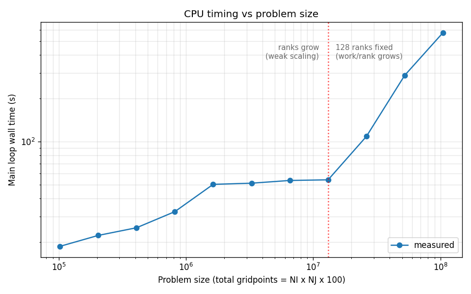
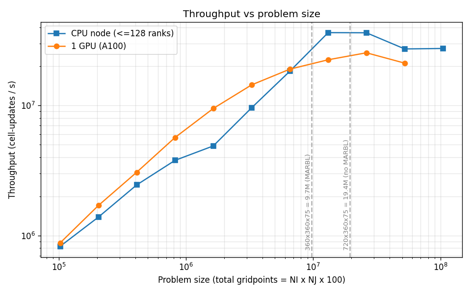
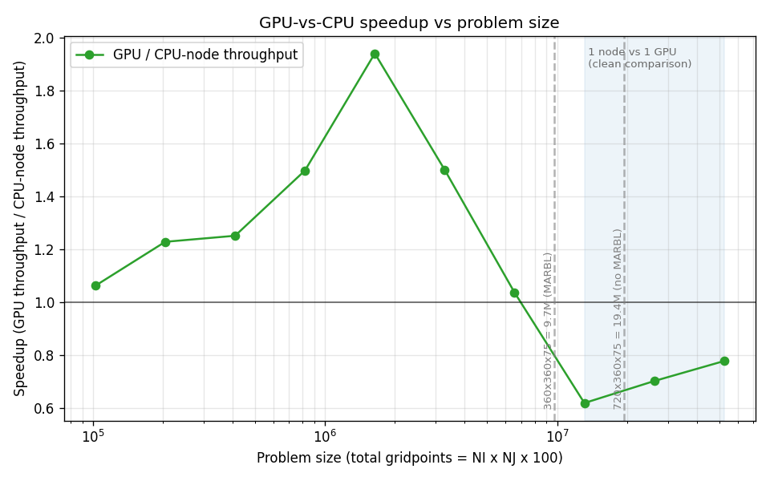
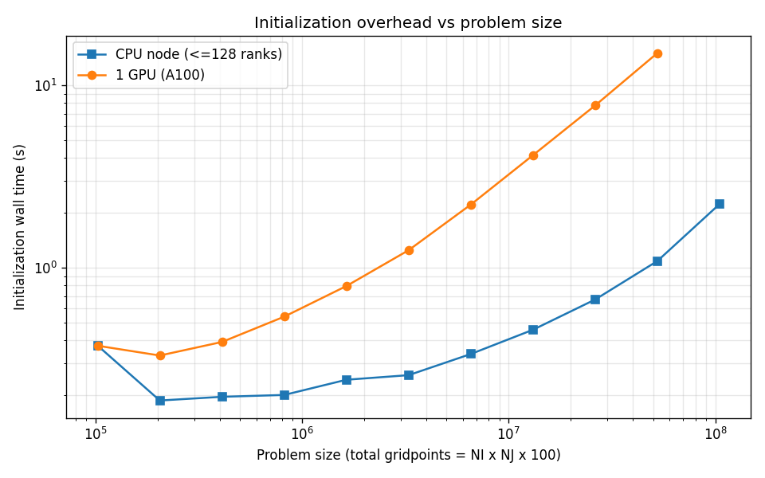

# MOM6 double_gyre GPU vs CPU scaling

**Generated:** 2026-06-04 07:35:47 on `derecho3`

## Intent

Characterize MOM6 throughput on Derecho for the `double_gyre` benchmark, comparing a single A100 GPU against a full 128-rank CPU node, to locate the problem size at which the GPU port becomes competitive and to confirm where production-scale workloads (~19.4M gridpoints/GPU without MARBL, ~9.7M with MARBL) land on the curve.

## Methodology

Each run advances exactly **150 dynamic steps** (`TIMEUNIT = dt` with `DAYMAX = 150`), so wall-clock time is directly comparable across problem sizes. The job-size index `i` sets a near-square layout of `i` 32x32 column blocks at NK=100.

- **CPU branch** (`run-scaling-sweep.sh cpu`): weak scaling. Ranks grow with `i` at a constant 32x32x100 gridpoints/rank up to the 128-rank node cap; beyond that, ranks stay at 128 and per-rank work grows.
- **GPU branch** (`run-scaling-sweep.sh gpu`): single-device problem-size scan (1 GPU, 1x1 decomposition) that reveals the throughput-saturation knee.

The per-run measurement is the cross-PE mean of the FMS `Main loop` timer. Throughput is reported as cell-updates/s = gridpoints x 150 / main-loop-time.

## CPU timing



One continuous problem-size scan. **Left of the divider** (weak scaling): ranks grow with the problem at a fixed 32x32x100 gridpoints/rank, so the rise is halo-exchange plus barotropic-solver collective overhead. **Right of the divider** (saturated node): ranks stay at the 128-rank cap and per-rank work grows, so time rises with the added work. The slope change at the divider is the transition between the two regimes.

## Throughput vs problem size



Dashed verticals mark the production operating points (19.4M gridpoints/GPU without MARBL; 9.7M with MARBL).

## GPU vs CPU speedup



Speedup is the single-GPU throughput divided by the CPU-node throughput at the same problem size (matched by job-size index `i`). The solid line at 1.0 is parity: above it the GPU wins, below it a full CPU node wins. The shaded band (problem size at or beyond the i=128 node-saturation point) is where the comparison is a clean 1-GPU-vs-1-full-node match; left of it the CPU branch is still weak-scaling across fewer than 128 ranks, so the ratio there mixes scaling regimes and should be read with care. Dashed verticals mark the production operating points.

## Head-to-head: 1 GPU vs 1 CPU node

Job sizes present in both branches, putting one full CPU node and one A100 on the identical problem. `GPU/CPU speedup` > 1 means the GPU wins at that size.

| i | gridpoints | CPU ranks | CPU loop (s) | GPU loop (s) | CPU thrpt (cell-up/s) | GPU thrpt (cell-up/s) | GPU/CPU speedup |
|---|---|---|---|---|---|---|---|
| 1 | 102,400 | 1 | 18.620 | 17.526 | 8.249e+05 | 8.764e+05 | 1.06x |
| 2 | 204,800 | 2 | 22.187 | 18.058 | 1.385e+06 | 1.701e+06 | 1.23x |
| 4 | 409,600 | 4 | 25.089 | 20.046 | 2.449e+06 | 3.065e+06 | 1.25x |
| 8 | 819,200 | 8 | 32.486 | 21.680 | 3.783e+06 | 5.668e+06 | 1.50x |
| 16 | 1,638,400 | 16 | 50.307 | 25.907 | 4.885e+06 | 9.486e+06 | 1.94x |
| 32 | 3,276,800 | 32 | 51.242 | 34.133 | 9.592e+06 | 1.440e+07 | 1.50x |
| 64 | 6,553,600 | 64 | 53.536 | 51.640 | 1.836e+07 | 1.904e+07 | 1.04x |
| 128 | 13,107,200 | 128 | 54.082 | 87.455 | 3.635e+07 | 2.248e+07 | 0.62x |
| 256 | 26,214,400 | 128 | 108.444 | 154.539 | 3.626e+07 | 2.544e+07 | 0.70x |
| 512 | 52,428,800 | 128 | 288.752 | 371.416 | 2.724e+07 | 2.117e+07 | 0.78x |

## Initialization overhead



The FMS `Initialization` timer -- setup, allocation, and (on the GPU) host-to-device staging and kernel setup before the main loop. This is a fixed per-run cost that the main-loop throughput numbers do not capture. The CPU node stays modest while the GPU's init cost climbs steeply with problem size, which both drags the GPU at small problems and tracks its march toward the single-device memory ceiling at large ones.

## Failed / missing runs

These runs produced no FMS `Main loop` timer -- the log never reached the timer table, so the run did not complete and is excluded from the plots and tables in this report. A failure only at the largest GPU size is the expected single-device memory ceiling (the GPU ran out of memory); confirm against the run log.

| platform | i | NI x NJ | gridpoints | log |
|---|---|---|---|---|
| gpu | 1024 | 1024x1024 | 104,857,600 | `gpu_1024.out` |

## Results: CPU branch

| i | ranks | NI x NJ | gridpoints | gp/rank | dt | main loop (s) | s/step | throughput (cell-up/s) |
|---|---|---|---|---|---|---|---|---|
| 1 | 1 | 32x32 | 102,400 | 102,400 | 1200 | 18.620 | 0.1241 | 8.249e+05 |
| 2 | 2 | 64x32 | 204,800 | 102,400 | 600 | 22.187 | 0.1479 | 1.385e+06 |
| 4 | 4 | 64x64 | 409,600 | 102,400 | 600 | 25.089 | 0.1673 | 2.449e+06 |
| 8 | 8 | 128x64 | 819,200 | 102,400 | 300 | 32.486 | 0.2166 | 3.783e+06 |
| 16 | 16 | 128x128 | 1,638,400 | 102,400 | 300 | 50.307 | 0.3354 | 4.885e+06 |
| 32 | 32 | 256x128 | 3,276,800 | 102,400 | 150 | 51.242 | 0.3416 | 9.592e+06 |
| 64 | 64 | 256x256 | 6,553,600 | 102,400 | 150 | 53.536 | 0.3569 | 1.836e+07 |
| 128 | 128 | 512x256 | 13,107,200 | 102,400 | 75 | 54.082 | 0.3605 | 3.635e+07 |
| 256 | 128 | 512x512 | 26,214,400 | 204,800 | 75 | 108.444 | 0.7230 | 3.626e+07 |
| 512 | 128 | 1024x512 | 52,428,800 | 409,600 | 37 | 288.752 | 1.9250 | 2.724e+07 |
| 1024 | 128 | 1024x1024 | 104,857,600 | 819,200 | 37 | 572.533 | 3.8169 | 2.747e+07 |


## Results: GPU branch

| i | NI x NJ | gridpoints | dt | main loop (s) | init (s) | s/step | throughput (cell-up/s) |
|---|---|---|---|---|---|---|---|
| 1 | 32x32 | 102,400 | 1200 | 17.526 | 0.373 | 0.1168 | 8.764e+05 |
| 2 | 64x32 | 204,800 | 600 | 18.058 | 0.330 | 0.1204 | 1.701e+06 |
| 4 | 64x64 | 409,600 | 600 | 20.046 | 0.392 | 0.1336 | 3.065e+06 |
| 8 | 128x64 | 819,200 | 300 | 21.680 | 0.539 | 0.1445 | 5.668e+06 |
| 16 | 128x128 | 1,638,400 | 300 | 25.907 | 0.794 | 0.1727 | 9.486e+06 |
| 32 | 256x128 | 3,276,800 | 150 | 34.133 | 1.248 | 0.2276 | 1.440e+07 |
| 64 | 256x256 | 6,553,600 | 150 | 51.640 | 2.220 | 0.3443 | 1.904e+07 |
| 128 | 512x256 | 13,107,200 | 75 | 87.455 | 4.145 | 0.5830 | 2.248e+07 |
| 256 | 512x512 | 26,214,400 | 75 | 154.539 | 7.772 | 1.0303 | 2.544e+07 |
| 512 | 1024x512 | 52,428,800 | 37 | 371.416 | 15.067 | 2.4761 | 2.117e+07 |

## Provenance

- **turbo-stack:** `21c5a82-dirty` (dirty working tree) (`/glade/work/altuntas/turbo-stack-for-prof`)
- **MOM6 submodule:** `ulm-10623-g108388fb6` (`108388fb608d8b861232bc203fac21ab7bc8f28b`)
- **GPU build flags** (ncar-nvhpc.mk):
  ```make
  FPPFLAGS := $(shell pkg-config --cflags yaml-0.1) -DHAVE_FC_DO_CONCURRENT_LOCAL
  FFLAGS += -mp=gpu -gpu=cc80,mem:separate -stdpar=gpu -Minfo=accel
  CFLAGS += -mp=gpu -gpu=cc80,mem:separate
  ```
- **Submodule snapshot:**
  ```
  f6466d899b66198593d6d40b3e8ca3dcbd343d8b dev-utils/gcovlens (heads/main)
   2c04fb23d0ee9ceef6d61f1021652ccab62e8324 submodules/MARBL (marbl0.48.2)
  +108388fb608d8b861232bc203fac21ab7bc8f28b submodules/MOM6 (ulm-10623-g108388fb6)
   6dd6d69bdb7c9efd4e210e1c459a897d1b02d21f submodules/amrex (25.11)
   7e526687b96ca685100f73edf7ef49214d5d5a19 submodules/infra/FMS2 (heads/dev/turbo)
   1647f85f695cd8f288b6471a99a078f48226efc0 submodules/infra/TIM (1647f85)
   12ac400e141854b54e5ce08c27c3301ef7d80074 submodules/pFUnit (v4.16.0-31-g12ac400)
  ```

> **Warning:** the turbo-stack working tree had uncommitted changes when this report was generated, so the commit hash does not fully capture the build. The GPU build flags above are recorded explicitly for this reason.

