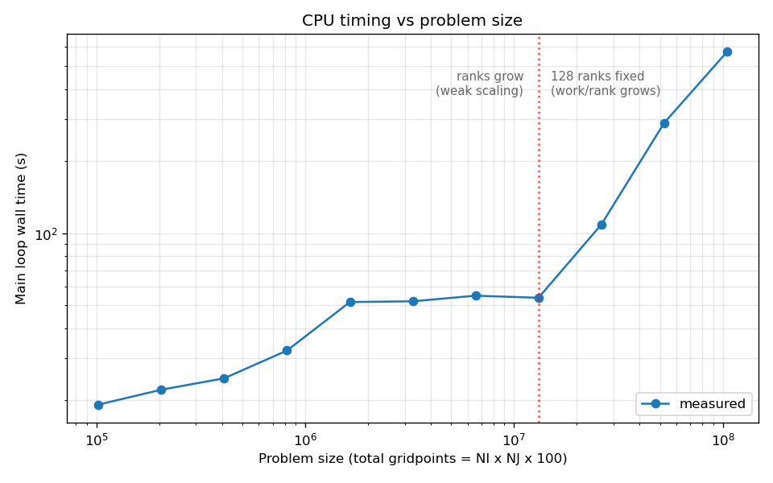
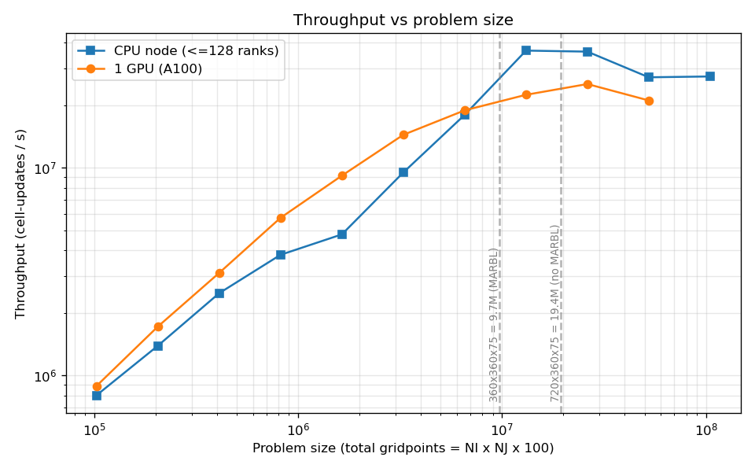
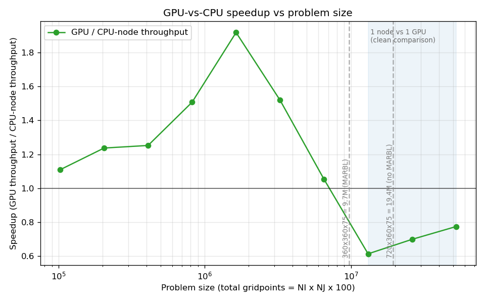
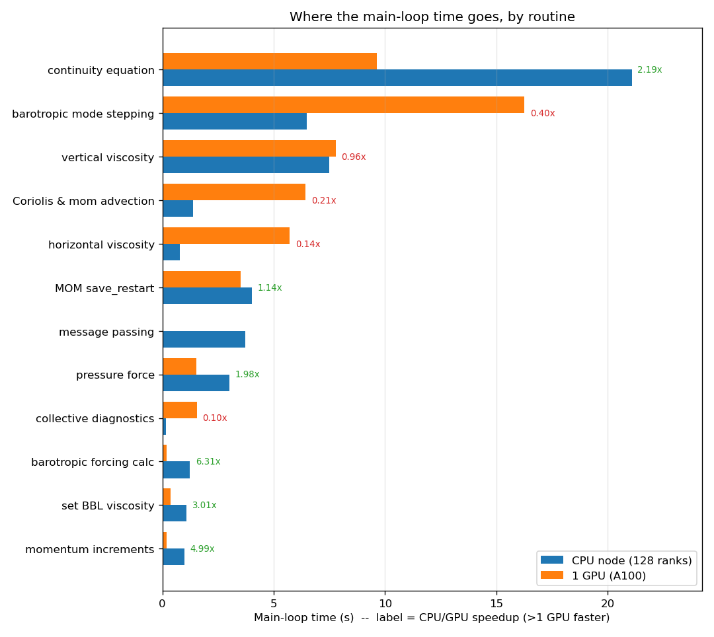
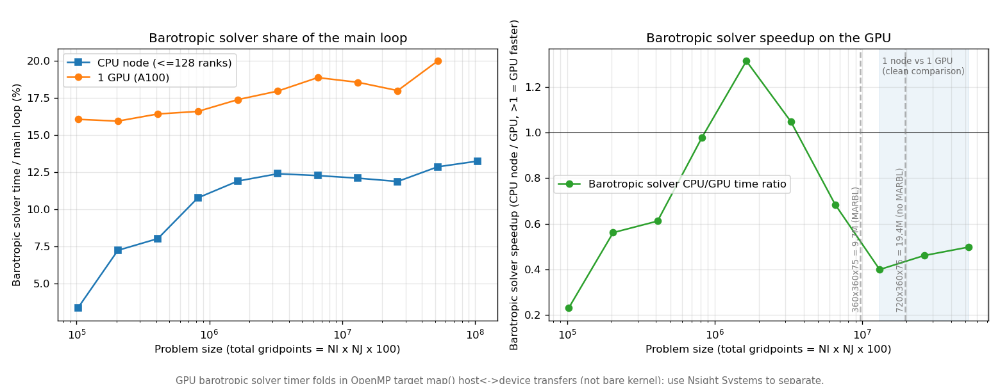
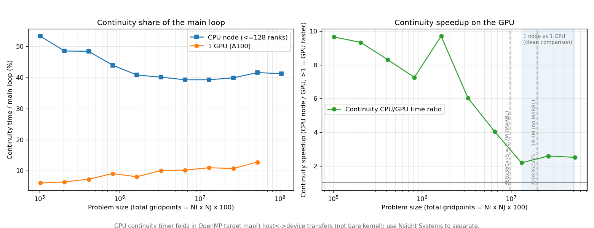
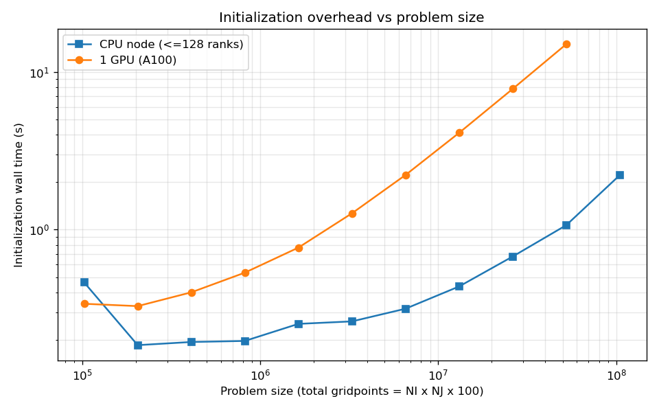

# MOM6 double_gyre GPU vs CPU scaling (Derecho)

**Generated:** 2026-06-04 14:33:33 on `derecho2`

## Intent

Measure MOM6 throughput on Derecho for the `double_gyre` benchmark, comparing a single A100 GPU against a full 128-rank CPU node. The GPU build offloads the model whole via OpenMP target directives (`-mp=gpu`). See `docs/METHODOLOGY.md` for the full rationale and the GPU routine-timer caveat.

<!-- commentary: key-finding -->

## Methodology

Each run advances exactly **150 dynamic steps** (`TIMEUNIT = dt` with `DAYMAX = 150`), so wall-clock time is directly comparable across problem sizes. The job-size index `i` sets a near-square layout of `i` 32x32 column blocks at NK=100.

- **CPU branch** (`run-scaling-sweep.sh cpu`): weak scaling. Ranks grow with `i` at a constant 32x32x100 gridpoints/rank up to the 128-rank node cap; beyond that, ranks stay at 128 and per-rank work grows.
- **GPU branch** (`run-scaling-sweep.sh gpu`): single-device problem-size scan (1 GPU, 1x1 decomposition).

The per-run measurement is the cross-PE mean of the FMS `Main loop` timer. Throughput is reported as cell-updates/s = gridpoints x 150 / main-loop-time. Runs made with `clock_grain = 'ROUTINE'` in `input.nml` also emit per-routine timers, which drive the breakdown sections below. See `docs/METHODOLOGY.md` for details, including the caveat that a GPU routine timer folds in the OpenMP `map()` host<->device transfers, not just the kernel.

## CPU timing



Main-loop wall time vs problem size, one continuous scan. Left of the divider, ranks grow with the problem at a fixed 32x32x100 gridpoints/rank (weak scaling); right of it, ranks stay at the 128-rank cap and per-rank work grows (saturated node).

<!-- commentary: cpu-timing -->

## Throughput vs problem size



Cell-updates/s vs problem size for the CPU node and one GPU. Dashed verticals mark the production operating points (19.4M gridpoints/GPU without MARBL; 9.7M with MARBL).

<!-- commentary: throughput -->

## GPU vs CPU speedup



Single-GPU throughput divided by CPU-node throughput at the same problem size (matched by job-size index `i`). The line at 1.0 is parity. The shaded band (problem size at or beyond the i=128 node-saturation point) is the clean 1-GPU-vs-1-full-node comparison; left of it the CPU branch is still weak-scaling across fewer than 128 ranks. Dashed verticals mark the production operating points.

<!-- commentary: speedup -->

## Head-to-head: 1 GPU vs 1 CPU node

Job sizes present in both branches: one full CPU node and one A100 on the identical problem. `GPU/CPU speedup` > 1 means the GPU has the higher throughput at that size.

| i | gridpoints | CPU ranks | CPU loop (s) | GPU loop (s) | CPU thrpt (cell-up/s) | GPU thrpt (cell-up/s) | GPU/CPU speedup |
|---|---|---|---|---|---|---|---|
| 1 | 102,400 | 1 | 19.206 | 17.323 | 7.997e+05 | 8.867e+05 | 1.11x |
| 2 | 204,800 | 2 | 22.166 | 17.921 | 1.386e+06 | 1.714e+06 | 1.24x |
| 4 | 409,600 | 4 | 24.737 | 19.756 | 2.484e+06 | 3.110e+06 | 1.25x |
| 8 | 819,200 | 8 | 32.315 | 21.440 | 3.803e+06 | 5.731e+06 | 1.51x |
| 16 | 1,638,400 | 16 | 51.518 | 26.848 | 4.770e+06 | 9.154e+06 | 1.92x |
| 32 | 3,276,800 | 32 | 51.881 | 34.153 | 9.474e+06 | 1.439e+07 | 1.52x |
| 64 | 6,553,600 | 64 | 54.760 | 52.063 | 1.795e+07 | 1.888e+07 | 1.05x |
| 128 | 13,107,200 | 128 | 53.668 | 87.619 | 3.663e+07 | 2.244e+07 | 0.61x |
| 256 | 26,214,400 | 128 | 108.573 | 155.529 | 3.622e+07 | 2.528e+07 | 0.70x |
| 512 | 52,428,800 | 128 | 288.653 | 373.182 | 2.724e+07 | 2.107e+07 | 0.77x |


<!-- commentary: head-to-head -->

## Where the main-loop time goes (by routine)

Per-routine FMS timers (grain 31) at i=128 (13,107,200 gridpoints, 512x256), 1 full CPU node vs 1 A100. `speedup` is CPU/GPU time, so > 1 means the GPU is faster on that routine; `n/a` marks routines below the 0.05s noise floor on a side (e.g. inter-rank message passing, which the lone GPU rank does not perform). Every GPU routine time includes its `target map()` host<->device transfers.



| routine | CPU node (s) | 1 A100 (s) | speedup (CPU/GPU) |
|---|---|---|---|
| continuity equation | 21.082 | 9.622 | 2.19x |
| barotropic mode stepping | 6.494 | 16.267 | 0.40x |
| vertical viscosity | 7.494 | 7.791 | 0.96x |
| Coriolis & mom advection | 1.371 | 6.438 | 0.21x |
| horizontal viscosity | 0.780 | 5.721 | 0.14x |
| MOM save_restart | 4.027 | 3.526 | 1.14x |
| message passing | 3.724 | 0.004 | n/a |
| pressure force | 3.002 | 1.518 | 1.98x |
| collective diagnostics | 0.159 | 1.553 | 0.10x |
| barotropic forcing calc | 1.244 | 0.197 | 6.31x |
| set BBL viscosity | 1.098 | 0.364 | 3.01x |
| momentum increments | 0.990 | 0.198 | 4.99x |


<!-- commentary: breakdown -->

## Barotropic solver

The barotropic solver is an explicit free-surface sub-cycle: many short barotropic steps per baroclinic step, each an offloaded `!$omp target` region. The plot isolates it across problem sizes; the table opens it into its sub-steps (pre-calcs, halo updates, stepping, post-calcs).



Sub-steps at i=128 (13,107,200 gridpoints), 1 CPU node vs 1 A100:

| sub-step | CPU node (s) | 1 A100 (s) | speedup (CPU/GPU) |
|---|---|---|---|
| BT pre-calcs only | 3.262 | 15.650 | 0.21x |
| BT pre-step halo updates | 2.142 | 0.020 | n/a |
| BT post-calcs only | 0.448 | 0.139 | 3.22x |
| BT stepping calcs only | 0.116 | 0.369 | 0.31x |
| BT post-step halo updates | 0.189 | 0.002 | n/a |
| BT stepping halo updates | 0.104 | 0.001 | n/a |


<!-- commentary: barotropic -->

## Continuity solver in isolation

The continuity solver isolated across problem sizes via MOM6's `(Ocean continuity equation)` timer (exposed by setting `clock_grain = 'ROUTINE'` in `input.nml`).

> **Caveat -- what this timer measures.** It is an FMS `mpp_clock` around the solver *call*; on the GPU it folds in the OpenMP `target ... map()` host<->device transfers and runtime overhead, not just the kernel. It is the right figure for the end-to-end cost of the routine, but it overstates the bare kernel. Splitting the two needs an Nsight Systems run (`run-profile.sh`).



**Left:** continuity time as a fraction of each branch's main loop. **Right:** continuity-only throughput ratio (GPU / CPU node) at matched sizes, transfers included.

| i | gridpoints | CPU cont (s) | GPU cont (s) | CPU %loop | GPU %loop | GPU/CPU continuity speedup |
|---|---|---|---|---|---|---|
| 1 | 102,400 | 10.234 | 1.060 | 53.3% | 6.1% | 9.66x |
| 2 | 204,800 | 10.759 | 1.153 | 48.5% | 6.4% | 9.33x |
| 4 | 409,600 | 11.981 | 1.440 | 48.4% | 7.3% | 8.32x |
| 8 | 819,200 | 14.203 | 1.956 | 44.0% | 9.1% | 7.26x |
| 16 | 1,638,400 | 21.034 | 2.168 | 40.8% | 8.1% | 9.70x |
| 32 | 3,276,800 | 20.809 | 3.447 | 40.1% | 10.1% | 6.04x |
| 64 | 6,553,600 | 21.505 | 5.322 | 39.3% | 10.2% | 4.04x |
| 128 | 13,107,200 | 21.082 | 9.622 | 39.3% | 11.0% | 2.19x |
| 256 | 26,214,400 | 43.317 | 16.698 | 39.9% | 10.7% | 2.59x |
| 512 | 52,428,800 | 120.069 | 47.745 | 41.6% | 12.8% | 2.51x |


<!-- commentary: continuity -->

## Initialization overhead



The FMS `Initialization` timer -- setup, allocation, and (on the GPU) host-to-device staging before the main loop -- vs problem size. A fixed per-run cost that the main-loop throughput numbers do not capture.

<!-- commentary: init -->

## Failed / missing runs

These runs produced no FMS `Main loop` timer, so they did not complete and are excluded from the plots and tables above. The `cause` column is the failing line from the run's stderr.

| platform | i | NI x NJ | gridpoints | log | cause (from stderr) |
|---|---|---|---|---|---|
| gpu | 1024 | 1024x1024 | 104,857,600 | `gpu_1024.out` | Accelerator Fatal Error: call to cuMemAlloc returned error 2 (CUDA_ERROR_OUT_OF_MEMORY): Out of memory |


<!-- commentary: failures -->

## Results: CPU branch

| i | ranks | NI x NJ | gridpoints | gp/rank | dt | main loop (s) | s/step | throughput (cell-up/s) |
|---|---|---|---|---|---|---|---|---|
| 1 | 1 | 32x32 | 102,400 | 102,400 | 1200 | 19.206 | 0.1280 | 7.997e+05 |
| 2 | 2 | 64x32 | 204,800 | 102,400 | 600 | 22.166 | 0.1478 | 1.386e+06 |
| 4 | 4 | 64x64 | 409,600 | 102,400 | 600 | 24.737 | 0.1649 | 2.484e+06 |
| 8 | 8 | 128x64 | 819,200 | 102,400 | 300 | 32.315 | 0.2154 | 3.803e+06 |
| 16 | 16 | 128x128 | 1,638,400 | 102,400 | 300 | 51.518 | 0.3435 | 4.770e+06 |
| 32 | 32 | 256x128 | 3,276,800 | 102,400 | 150 | 51.881 | 0.3459 | 9.474e+06 |
| 64 | 64 | 256x256 | 6,553,600 | 102,400 | 150 | 54.760 | 0.3651 | 1.795e+07 |
| 128 | 128 | 512x256 | 13,107,200 | 102,400 | 75 | 53.668 | 0.3578 | 3.663e+07 |
| 256 | 128 | 512x512 | 26,214,400 | 204,800 | 75 | 108.573 | 0.7238 | 3.622e+07 |
| 512 | 128 | 1024x512 | 52,428,800 | 409,600 | 37 | 288.653 | 1.9244 | 2.724e+07 |
| 1024 | 128 | 1024x1024 | 104,857,600 | 819,200 | 37 | 571.996 | 3.8133 | 2.750e+07 |


## Results: GPU branch

| i | NI x NJ | gridpoints | dt | main loop (s) | init (s) | s/step | throughput (cell-up/s) |
|---|---|---|---|---|---|---|---|
| 1 | 32x32 | 102,400 | 1200 | 17.323 | 0.339 | 0.1155 | 8.867e+05 |
| 2 | 64x32 | 204,800 | 600 | 17.921 | 0.328 | 0.1195 | 1.714e+06 |
| 4 | 64x64 | 409,600 | 600 | 19.756 | 0.400 | 0.1317 | 3.110e+06 |
| 8 | 128x64 | 819,200 | 300 | 21.440 | 0.534 | 0.1429 | 5.731e+06 |
| 16 | 128x128 | 1,638,400 | 300 | 26.848 | 0.769 | 0.1790 | 9.154e+06 |
| 32 | 256x128 | 3,276,800 | 150 | 34.153 | 1.269 | 0.2277 | 1.439e+07 |
| 64 | 256x256 | 6,553,600 | 150 | 52.063 | 2.220 | 0.3471 | 1.888e+07 |
| 128 | 512x256 | 13,107,200 | 75 | 87.619 | 4.104 | 0.5841 | 2.244e+07 |
| 256 | 512x512 | 26,214,400 | 75 | 155.529 | 7.792 | 1.0369 | 2.528e+07 |
| 512 | 1024x512 | 52,428,800 | 37 | 373.182 | 14.963 | 2.4879 | 2.107e+07 |

## Provenance

- **turbo-stack:** `2524b9d-dirty` (dirty working tree) (`/glade/work/altuntas/turbo-stack-for-prof`)
- **MOM6 submodule:** `ulm-10623-g108388fb6` (`108388fb608d8b861232bc203fac21ab7bc8f28b`)
- **GPU build flags** (ncar-nvhpc.mk):
  ```make
  FPPFLAGS := $(shell pkg-config --cflags yaml-0.1) -DHAVE_FC_DO_CONCURRENT_LOCAL
  FFLAGS += -mp=gpu -gpu=cc80,mem:separate -stdpar=gpu -Minfo=accel
  CFLAGS += -mp=gpu -gpu=cc80,mem:separate
  ```
- **Submodule snapshot:**
  ```
  f6466d899b66198593d6d40b3e8ca3dcbd343d8b dev-utils/gcovlens (heads/main)
   2c04fb23d0ee9ceef6d61f1021652ccab62e8324 submodules/MARBL (marbl0.48.2)
  +108388fb608d8b861232bc203fac21ab7bc8f28b submodules/MOM6 (ulm-10623-g108388fb6)
   6dd6d69bdb7c9efd4e210e1c459a897d1b02d21f submodules/amrex (25.11)
   7e526687b96ca685100f73edf7ef49214d5d5a19 submodules/infra/FMS2 (heads/dev/turbo)
   1647f85f695cd8f288b6471a99a078f48226efc0 submodules/infra/TIM (1647f85)
   12ac400e141854b54e5ce08c27c3301ef7d80074 submodules/pFUnit (v4.16.0-31-g12ac400)
  ```

> **Warning:** the turbo-stack working tree had uncommitted changes when this report was generated, so the commit hash does not fully capture the build. The GPU build flags above are recorded explicitly for this reason.

