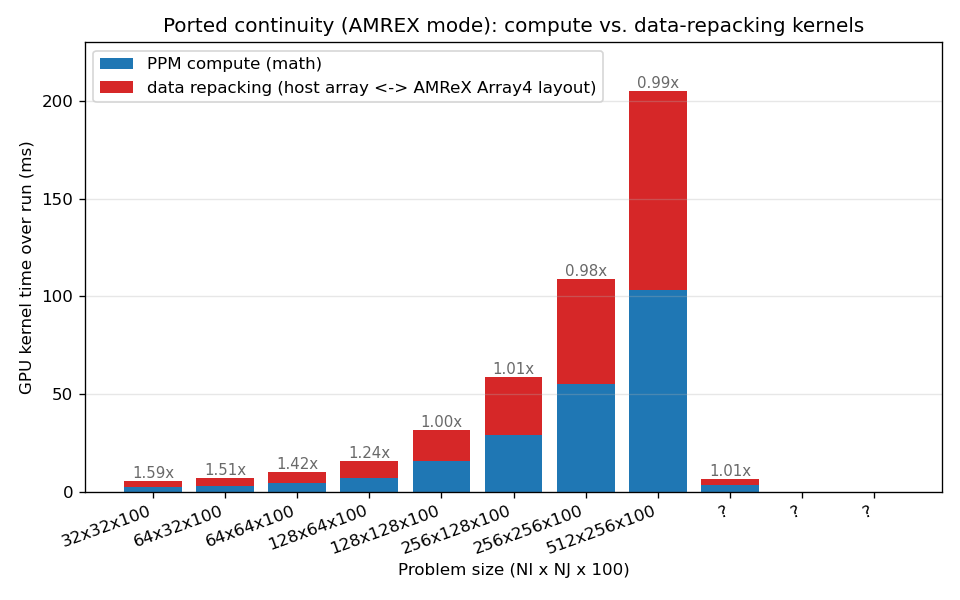
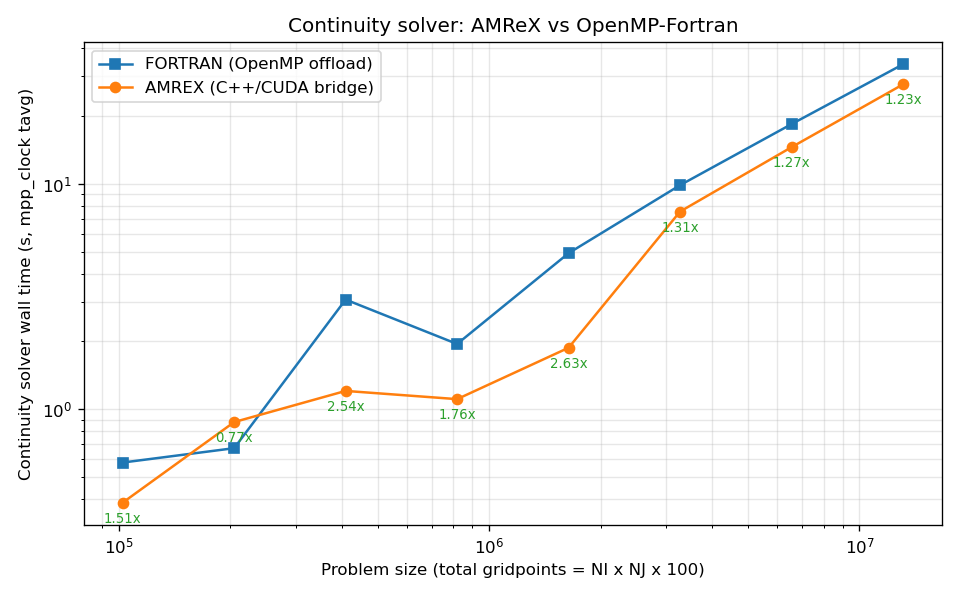
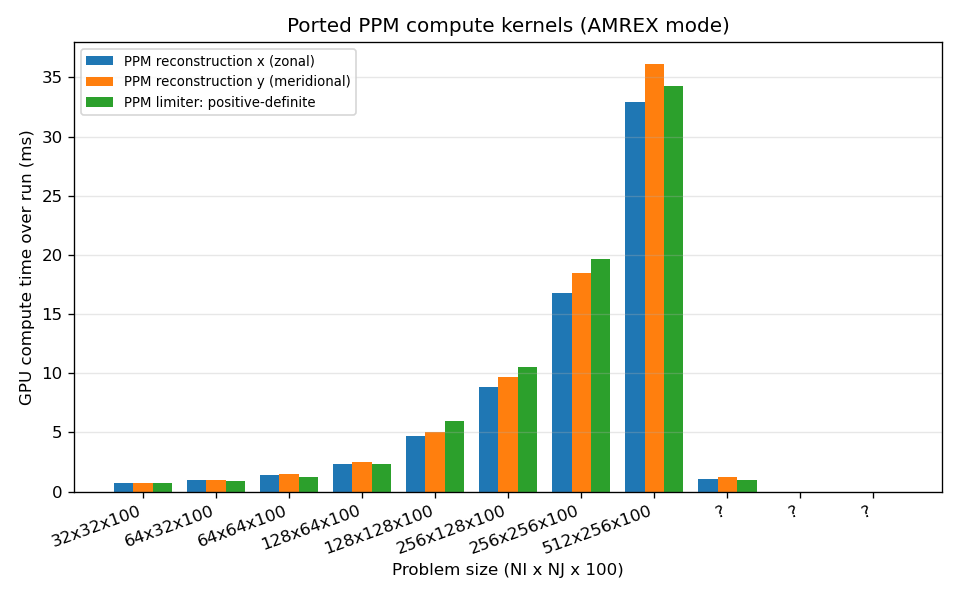

# AMReX continuity port: compute vs. data movement

**Generated:** 2026-06-04 22:05:39 on `derecho3`


## Intent

Quantify the cost of the continuity PPM sub-kernels ported to C++/AMReX, and split that cost into GPU **compute** versus the **data movement** the bridge performs around each call -- both the on-device repack kernels and the host<->device PCIe copies. The FMS mpp_clock timer reports only the sum; this report uses Nsight Systems to separate them.

<!-- commentary: key-finding -->

## Methodology

- One executable (`MOM6_using_TIM`, GPU offload + CUDA AMReX); the AMREX run sets six `*_MODE=AMREX` env vars so the ported PPM kernels take the C++/AMReX bridge. double_gyre, single rank on one A100, 20 dynamic steps.
- GPU kernels attributed by demangled name: `MOM::` = ported PPM compute, `turbotmp::copy_*` = bridge data repacking (host array <-> AMReX Array4 layout), other `amrex::`/`turbotmp::` = AMReX infrastructure, rest = whole-model OpenMP offload. PCIe copies split by API (`cudaMemcpyAsync` = bridge, `cuMemcpy*Async_v2` = OpenMP).
- The mpp_clock continuity timer folds the AMReX call stack, the repacking kernels, and the device copies together; only the Nsight split below separates compute from data movement.
- NOTE: to run on the GPU at all this build needs the depth-list and restart checksums disabled (`READ_DEPTH_LIST=False`, `RESTART_CONTROL=-1`); MOM6's field_checksum routes to a TIM GPU reduction over a host pointer. See PROFILING_DECISIONS.md.

<!-- commentary: methodology -->

## GPU kernel time by category (AMREX mode)

From the AMREX-mode runs only. On-device GPU *kernel* time (the work the GPU executes); host<->device PCIe copies are not in these numbers -- they are reported separately below.

| Size | PPM compute (ms) | Data repacking (ms) | AMReX infra (ms) | OpenMP whole-model (ms) |
|---|--:|--:|--:|--:|
| 32x32x100 | 2.11 | 3.35 | 5.03 | 665.45 |
| 64x32x100 | 2.82 | 4.27 | 5.05 | 690.09 |
| 64x64x100 | 4.16 | 5.93 | 5.05 | 766.13 |
| 128x64x100 | 7.09 | 8.80 | 5.05 | 834.50 |
| 128x128x100 | 15.70 | 15.76 | 5.04 | 1,083.56 |
| 256x128x100 | 29.07 | 29.42 | 5.08 | 1,577.94 |
| 256x256x100 | 54.93 | 53.89 | 5.05 | 2,310.13 |
| 512x256x100 | 103.35 | 102.06 | 5.06 | 4,185.48 |
| ? | 3.22 | 3.24 | 5.05 | 52.04 |
| ? | 0.00 | 0.00 | 5.05 | 0.00 |
| ? | 0.00 | 0.00 | 5.03 | 0.00 |

<!-- commentary: kernel-category -->

## Compute vs. data repacking -- the ported piece (AMREX mode)

AMREX-mode runs only. Both bars in the figure are on-device GPU *kernel* time: PPM compute kernels vs. the data-repacking kernels (on-device layout conversion, Fortran array <-> AMReX Array4). The host<->device PCIe transfers are NOT kernel time and are not shown here -- they are reported separately in the PCIe section. The figure's bar labels give the data-repacking / compute time ratio.




| Size | PPM compute (ms) | Data repacking kernels (ms) | Repacking / compute |
|---|--:|--:|--:|
| 32x32x100 | 2.11 | 3.35 | 1.59x |
| 64x32x100 | 2.82 | 4.27 | 1.51x |
| 64x64x100 | 4.16 | 5.93 | 1.42x |
| 128x64x100 | 7.09 | 8.80 | 1.24x |
| 128x128x100 | 15.70 | 15.76 | 1.00x |
| 256x128x100 | 29.07 | 29.42 | 1.01x |
| 256x256x100 | 54.93 | 53.89 | 0.98x |
| 512x256x100 | 103.35 | 102.06 | 0.99x |
| ? | 3.22 | 3.24 | 1.01x |
| ? | 0.00 | 0.00 | 0.00x |
| ? | 0.00 | 0.00 | 0.00x |

<!-- commentary: compute-vs-repacking -->

## Continuity solver, end-to-end: AMReX vs OpenMP-Fortran (both modes)

The full mpp_clock continuity wall time for each path, matched by problem size. This is the **folded** number: it INCLUDES on-device compute, the data-repacking kernels, AND the host<->device PCIe copies -- everything the solver does. (The Nsight breakdown above separates those pieces for the AMReX path.) In the figure, both axes are log-scaled and the per-point labels give the FORTRAN / AMREX wall-time ratio (>1 = AMReX faster).




<!-- commentary: continuity-headtohead -->

## Ported PPM compute kernels (AMREX mode)

Per-kernel on-device GPU *compute* time (no data movement) for the ported PPM kernels, AMREX mode. The figure plots the kernels that launched; the table lists all six, with a Note on the three that launch no kernel of their own in this configuration.




A `-`/`0` row is expected for the kernels noted below, not a missing measurement.

| Size | Ported PPM kernel | GPU compute time (ms) | Launches | Note |
|---|---|--:|--:|---|
| 32x32x100 | PPM reconstruction x (zonal) | 0.73 | 122 |  |
| 32x32x100 | PPM reconstruction y (meridional) | 0.70 | 122 |  |
| 32x32x100 | PPM limiter: positive-definite | 0.69 | 122 |  |
| 32x32x100 | PPM limiter: CW84 monotonic | - | 0 | limiter selected by MONOTONIC_CONTINUITY; the alternative is the positive-definite limiter |
| 32x32x100 | zonal edge thickness | - | 0 | wrapper over PPM_reconstruction_x; launches its own kernel only on the 1st-order-upwind path |
| 32x32x100 | meridional edge thickness | - | 0 | wrapper over PPM_reconstruction_y; launches its own kernel only on the 1st-order-upwind path |
| 64x32x100 | PPM reconstruction x (zonal) | 0.96 | 122 |  |
| 64x32x100 | PPM reconstruction y (meridional) | 0.99 | 122 |  |
| 64x32x100 | PPM limiter: positive-definite | 0.87 | 122 |  |
| 64x32x100 | PPM limiter: CW84 monotonic | - | 0 | limiter selected by MONOTONIC_CONTINUITY; the alternative is the positive-definite limiter |
| 64x32x100 | zonal edge thickness | - | 0 | wrapper over PPM_reconstruction_x; launches its own kernel only on the 1st-order-upwind path |
| 64x32x100 | meridional edge thickness | - | 0 | wrapper over PPM_reconstruction_y; launches its own kernel only on the 1st-order-upwind path |
| 64x64x100 | PPM reconstruction x (zonal) | 1.43 | 122 |  |
| 64x64x100 | PPM reconstruction y (meridional) | 1.51 | 122 |  |
| 64x64x100 | PPM limiter: positive-definite | 1.22 | 122 |  |
| 64x64x100 | PPM limiter: CW84 monotonic | - | 0 | limiter selected by MONOTONIC_CONTINUITY; the alternative is the positive-definite limiter |
| 64x64x100 | zonal edge thickness | - | 0 | wrapper over PPM_reconstruction_x; launches its own kernel only on the 1st-order-upwind path |
| 64x64x100 | meridional edge thickness | - | 0 | wrapper over PPM_reconstruction_y; launches its own kernel only on the 1st-order-upwind path |
| 128x64x100 | PPM reconstruction x (zonal) | 2.30 | 122 |  |
| 128x64x100 | PPM reconstruction y (meridional) | 2.49 | 122 |  |
| 128x64x100 | PPM limiter: positive-definite | 2.30 | 122 |  |
| 128x64x100 | PPM limiter: CW84 monotonic | - | 0 | limiter selected by MONOTONIC_CONTINUITY; the alternative is the positive-definite limiter |
| 128x64x100 | zonal edge thickness | - | 0 | wrapper over PPM_reconstruction_x; launches its own kernel only on the 1st-order-upwind path |
| 128x64x100 | meridional edge thickness | - | 0 | wrapper over PPM_reconstruction_y; launches its own kernel only on the 1st-order-upwind path |
| 128x128x100 | PPM reconstruction x (zonal) | 4.70 | 122 |  |
| 128x128x100 | PPM reconstruction y (meridional) | 5.01 | 122 |  |
| 128x128x100 | PPM limiter: positive-definite | 6.00 | 122 |  |
| 128x128x100 | PPM limiter: CW84 monotonic | - | 0 | limiter selected by MONOTONIC_CONTINUITY; the alternative is the positive-definite limiter |
| 128x128x100 | zonal edge thickness | - | 0 | wrapper over PPM_reconstruction_x; launches its own kernel only on the 1st-order-upwind path |
| 128x128x100 | meridional edge thickness | - | 0 | wrapper over PPM_reconstruction_y; launches its own kernel only on the 1st-order-upwind path |
| 256x128x100 | PPM reconstruction x (zonal) | 8.86 | 122 |  |
| 256x128x100 | PPM reconstruction y (meridional) | 9.66 | 122 |  |
| 256x128x100 | PPM limiter: positive-definite | 10.54 | 122 |  |
| 256x128x100 | PPM limiter: CW84 monotonic | - | 0 | limiter selected by MONOTONIC_CONTINUITY; the alternative is the positive-definite limiter |
| 256x128x100 | zonal edge thickness | - | 0 | wrapper over PPM_reconstruction_x; launches its own kernel only on the 1st-order-upwind path |
| 256x128x100 | meridional edge thickness | - | 0 | wrapper over PPM_reconstruction_y; launches its own kernel only on the 1st-order-upwind path |
| 256x256x100 | PPM reconstruction x (zonal) | 16.77 | 122 |  |
| 256x256x100 | PPM reconstruction y (meridional) | 18.48 | 122 |  |
| 256x256x100 | PPM limiter: positive-definite | 19.68 | 122 |  |
| 256x256x100 | PPM limiter: CW84 monotonic | - | 0 | limiter selected by MONOTONIC_CONTINUITY; the alternative is the positive-definite limiter |
| 256x256x100 | zonal edge thickness | - | 0 | wrapper over PPM_reconstruction_x; launches its own kernel only on the 1st-order-upwind path |
| 256x256x100 | meridional edge thickness | - | 0 | wrapper over PPM_reconstruction_y; launches its own kernel only on the 1st-order-upwind path |
| 512x256x100 | PPM reconstruction x (zonal) | 32.91 | 122 |  |
| 512x256x100 | PPM reconstruction y (meridional) | 36.15 | 122 |  |
| 512x256x100 | PPM limiter: positive-definite | 34.29 | 122 |  |
| 512x256x100 | PPM limiter: CW84 monotonic | - | 0 | limiter selected by MONOTONIC_CONTINUITY; the alternative is the positive-definite limiter |
| 512x256x100 | zonal edge thickness | - | 0 | wrapper over PPM_reconstruction_x; launches its own kernel only on the 1st-order-upwind path |
| 512x256x100 | meridional edge thickness | - | 0 | wrapper over PPM_reconstruction_y; launches its own kernel only on the 1st-order-upwind path |
| ? | PPM reconstruction x (zonal) | 1.07 | 2 |  |
| ? | PPM reconstruction y (meridional) | 1.19 | 2 |  |
| ? | PPM limiter: positive-definite | 0.96 | 2 |  |
| ? | PPM limiter: CW84 monotonic | - | 0 | limiter selected by MONOTONIC_CONTINUITY; the alternative is the positive-definite limiter |
| ? | zonal edge thickness | - | 0 | wrapper over PPM_reconstruction_x; launches its own kernel only on the 1st-order-upwind path |
| ? | meridional edge thickness | - | 0 | wrapper over PPM_reconstruction_y; launches its own kernel only on the 1st-order-upwind path |
| ? | PPM reconstruction x (zonal) | - | 0 |  |
| ? | PPM reconstruction y (meridional) | - | 0 |  |
| ? | PPM limiter: positive-definite | - | 0 |  |
| ? | PPM limiter: CW84 monotonic | - | 0 | limiter selected by MONOTONIC_CONTINUITY; the alternative is the positive-definite limiter |
| ? | zonal edge thickness | - | 0 | wrapper over PPM_reconstruction_x; launches its own kernel only on the 1st-order-upwind path |
| ? | meridional edge thickness | - | 0 | wrapper over PPM_reconstruction_y; launches its own kernel only on the 1st-order-upwind path |
| ? | PPM reconstruction x (zonal) | - | 0 |  |
| ? | PPM reconstruction y (meridional) | - | 0 |  |
| ? | PPM limiter: positive-definite | - | 0 |  |
| ? | PPM limiter: CW84 monotonic | - | 0 | limiter selected by MONOTONIC_CONTINUITY; the alternative is the positive-definite limiter |
| ? | zonal edge thickness | - | 0 | wrapper over PPM_reconstruction_x; launches its own kernel only on the 1st-order-upwind path |
| ? | meridional edge thickness | - | 0 | wrapper over PPM_reconstruction_y; launches its own kernel only on the 1st-order-upwind path |

<!-- commentary: ported-breakdown -->

## Bridge data-repacking kernels (AMREX mode)

AMREX-mode runs only. On-device GPU time of the layout-conversion kernels (host Fortran array <-> AMReX Array4); the PCIe transfers these feed are separate, below.

| Size | Bridge data-repacking kernel | GPU time (ms) | Launches |
|---|---|--:|--:|
| 32x32x100 | host -> Array4 pack (H2D side) | 2.22 | 488 |
| 32x32x100 | Array4 -> host unpack (D2H side) | 1.13 | 244 |
| 64x32x100 | host -> Array4 pack (H2D side) | 2.82 | 488 |
| 64x32x100 | Array4 -> host unpack (D2H side) | 1.45 | 244 |
| 64x64x100 | host -> Array4 pack (H2D side) | 3.81 | 488 |
| 64x64x100 | Array4 -> host unpack (D2H side) | 2.11 | 244 |
| 128x64x100 | host -> Array4 pack (H2D side) | 5.52 | 488 |
| 128x64x100 | Array4 -> host unpack (D2H side) | 3.27 | 244 |
| 128x128x100 | host -> Array4 pack (H2D side) | 9.70 | 488 |
| 128x128x100 | Array4 -> host unpack (D2H side) | 6.06 | 244 |
| 256x128x100 | host -> Array4 pack (H2D side) | 18.24 | 488 |
| 256x128x100 | Array4 -> host unpack (D2H side) | 11.18 | 244 |
| 256x256x100 | host -> Array4 pack (H2D side) | 32.92 | 488 |
| 256x256x100 | Array4 -> host unpack (D2H side) | 20.98 | 244 |
| 512x256x100 | host -> Array4 pack (H2D side) | 61.82 | 488 |
| 512x256x100 | Array4 -> host unpack (D2H side) | 40.25 | 244 |
| ? | host -> Array4 pack (H2D side) | 1.95 | 8 |
| ? | Array4 -> host unpack (D2H side) | 1.29 | 4 |
| ? | host -> Array4 pack (H2D side) | - | 0 |
| ? | Array4 -> host unpack (D2H side) | - | 0 |
| ? | host -> Array4 pack (H2D side) | - | 0 |
| ? | Array4 -> host unpack (D2H side) | - | 0 |

<!-- commentary: repacking -->

## Host<->device PCIe copies (AMREX mode)

From the AMREX-mode runs. The device-side H2D/D2H totals lump the bridge and the whole-model OpenMP offload together; the last two columns split memcpy *API* time by entry point (`cudaMemcpyAsync` = bridge, `cuMemcpy*` = OpenMP).

| Size | H2D total (GB) | D2H total (GB) | H2D time (ms) | D2H time (ms) | Bridge memcpy API (ms, calls) | OpenMP memcpy API (ms, calls) |
|---|--:|--:|--:|--:|--:|--:|
| 32x32x100 | 0.6 | 0.5 | 48.95 | 39.59 | 61.59 (732) | 258.81 (19082) |
| 64x32x100 | 1.1 | 1.0 | 74.32 | 75.19 | 101.82 (732) | 285.42 (19082) |
| 64x64x100 | 2.0 | 1.8 | 128.40 | 133.12 | 181.58 (732) | 359.91 (19081) |
| 128x64x100 | 3.8 | 3.3 | 261.60 | 268.36 | 373.38 (732) | 450.17 (19081) |
| 128x128x100 | 7.3 | 6.4 | 515.55 | 491.24 | 704.24 (732) | 645.07 (19084) |
| 256x128x100 | 14.2 | 12.4 | 1,023.36 | 936.51 | 1,379.13 (732) | 1,019.04 (19084) |
| 256x256x100 | 27.7 | 24.2 | 2,008.27 | 1,920.61 | 2,775.62 (732) | 1,781.84 (19079) |
| 512x256x100 | 54.7 | 47.8 | 3,920.43 | 3,673.81 | 5,304.09 (732) | 3,274.82 (19096) |
| ? | 10.8 | 1.9 | 834.80 | 159.20 | 168.48 (12) | 837.71 (353) |
| ? | 9.4 | 0.0 | 700.66 | 0.00 | 0.00 (0) | 704.17 (156) |
| ? | 9.5 | 0.0 | 701.29 | 0.00 | 0.00 (0) | 703.90 (110) |

<!-- commentary: pcie -->

## Folded mpp_clock timer (both modes)

What the MOM timer alone reports (compute + repacking + copies, not separable from it), shown so the Nsight split can be read against it. Both FORTRAN and AMREX cells are listed (Mode column); FORTRAN cells also show run status.

| Size | Mode | Status | mpp_clock continuity tavg (s) | Main loop tavg (s) |
|---|---|---|--:|--:|
| 32x32x100 | FORTRAN | completed | 0.581 | 4.277 |
| 32x32x100 | AMREX | completed | 0.386 | 4.074 |
| 64x32x100 | FORTRAN | completed | 0.672 | 4.383 |
| 64x32x100 | AMREX | completed | 0.878 | 4.638 |
| 64x64x100 | FORTRAN | completed | 3.065 | 6.904 |
| 64x64x100 | AMREX | completed | 1.206 | 5.328 |
| 128x64x100 | FORTRAN | completed | 1.948 | 5.991 |
| 128x64x100 | AMREX | completed | 1.109 | 5.185 |
| 128x128x100 | FORTRAN | completed | 4.922 | 9.509 |
| 128x128x100 | AMREX | completed | 1.874 | 6.648 |
| 256x128x100 | FORTRAN | completed | 9.854 | 15.508 |
| 256x128x100 | AMREX | completed | 7.527 | 13.320 |
| 256x256x100 | FORTRAN | completed | 18.383 | 26.102 |
| 256x256x100 | AMREX | completed | 14.524 | 22.674 |
| 512x256x100 | FORTRAN | completed | 33.852 | 46.702 |
| 512x256x100 | AMREX | completed | 27.572 | 40.149 |
| 256 | FORTRAN | did not complete | - | - |
| 256 | AMREX | did not complete | - | - |
| 512 | FORTRAN | did not complete | - | - |
| 512 | AMREX | did not complete | - | - |
| 1024 | FORTRAN | did not complete | - | - |
| 1024 | AMREX | did not complete | - | - |

<!-- commentary: folded-timer -->

## Provenance

- **turbo-stack:** `2524b9d-dirty` (dirty working tree) (`/glade/work/altuntas/turbo-stack-for-prof`)
- **MOM6 submodule:** `ulm-10624-g9acee165d` (`9acee165dd05caa72db7f90ae7c0c784f76b5b65`)
- **GPU build flags** (ncar-nvhpc.mk):
  ```make
  FPPFLAGS := $(shell pkg-config --cflags yaml-0.1) -DHAVE_FC_DO_CONCURRENT_LOCAL
  FFLAGS += -mp=gpu -gpu=cc80,mem:separate -stdpar=gpu -Minfo=accel
  CFLAGS += -mp=gpu -gpu=cc80,mem:separate
  ```
- **Submodule snapshot:**
  ```
  f6466d899b66198593d6d40b3e8ca3dcbd343d8b dev-utils/gcovlens (heads/main)
   2c04fb23d0ee9ceef6d61f1021652ccab62e8324 submodules/MARBL (marbl0.48.2)
  +9acee165dd05caa72db7f90ae7c0c784f76b5b65 submodules/MOM6 (ulm-10624-g9acee165d)
   6dd6d69bdb7c9efd4e210e1c459a897d1b02d21f submodules/amrex (25.11)
   7e526687b96ca685100f73edf7ef49214d5d5a19 submodules/infra/FMS2 (heads/dev/turbo)
   1647f85f695cd8f288b6471a99a078f48226efc0 submodules/infra/TIM (1647f85)
   12ac400e141854b54e5ce08c27c3301ef7d80074 submodules/pFUnit (v4.16.0-31-g12ac400)
  ```

> **Warning:** the turbo-stack working tree had uncommitted changes when this report was generated, so the commit hash does not fully capture the build. The GPU build flags above are recorded explicitly for this reason.

