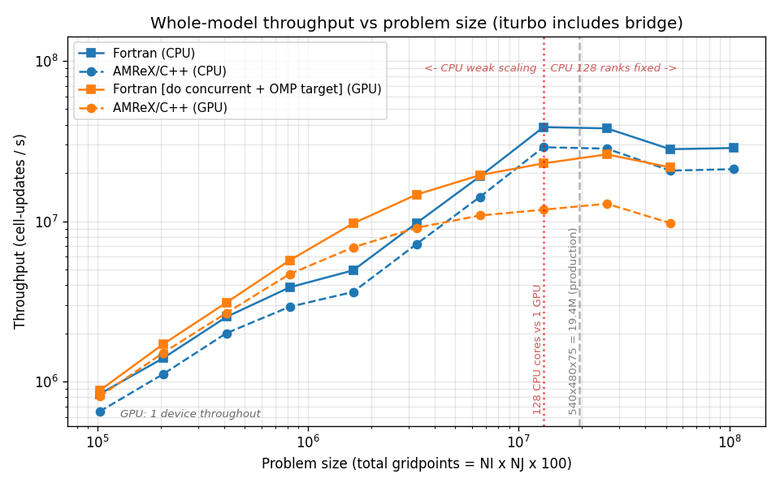
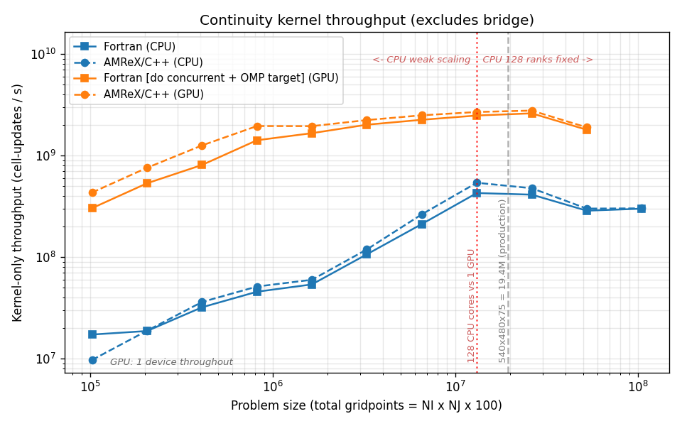
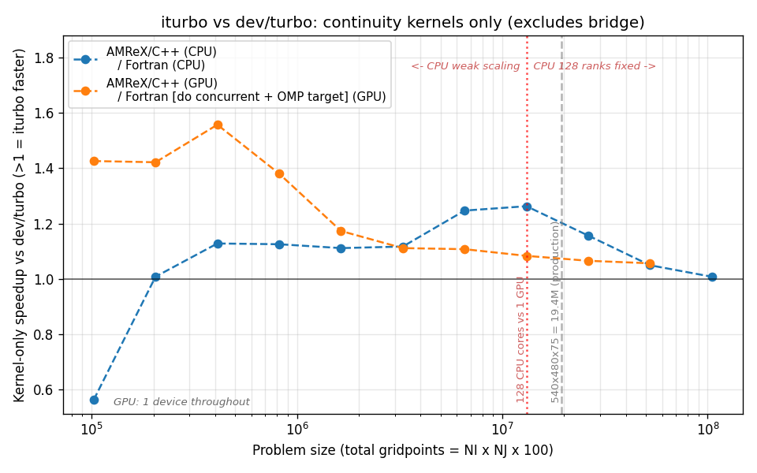
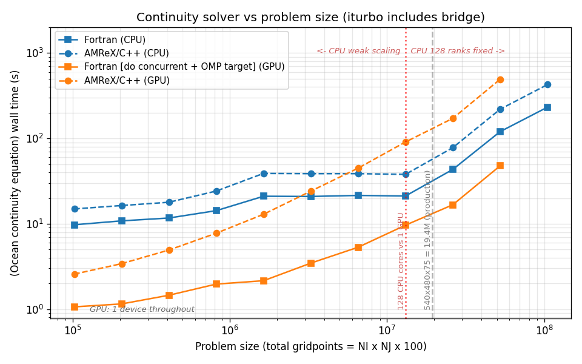
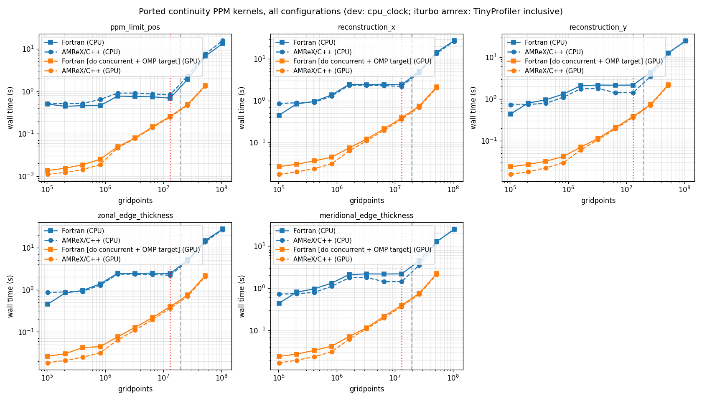

# MOM6 double_gyre four-config comparison sweep

**Generated:** 2026-06-16 12:14:50 on `derecho2`

## Intent

Compare four MOM6 `double_gyre` configurations -- {dev/turbo, iturbo-AMReX} x {CPU, GPU} -- across the standard problem-size sweep on Derecho. Each pairs an executable from a specific turbo-stack checkout with, for the AMReX variants, the six `*_MODE=AMREX` env vars that route the ported continuity PPM kernels through C++/AMReX.

| config | abbrev | plot label | stack | resources | PPM kernel routing |
|---|---|---|---|---|---|
| `dev_turbo_CPU` | dt_C | Fortran (CPU) | `dev-turbo-cpu` (`/glade/work/altuntas/turbo-stack-dev-turbo-cpu`) | min(i, 128) ranks | Fortran |
| `iturbo_CPU_amrex` | it_C_ax | AMReX/C++ (CPU) | `iturbo-cpu` (`/glade/work/altuntas/turbo-stack-iturbo-cpu`) | min(i, 128) ranks | AMReX (`*_MODE=AMREX`) |
| `dev_turbo_GPU` | dt_G | Fortran [do concurrent + OMP target] (GPU) | `dev-turbo` (`/glade/work/altuntas/turbo-stack-dev-turbo`) | 1 rank + 1 GPU | Fortran |
| `iturbo_GPU_amrex` | it_G_ax | AMReX/C++ (GPU) | `iturbo` (`/glade/work/altuntas/turbo-stack-iturbo`) | 1 rank + 1 GPU | AMReX (`*_MODE=AMREX`) |


<!-- commentary: key-finding -->

## Methodology

Each run advances exactly **150 dynamic steps** (`TIMEUNIT = dt`, `DAYMAX = 150`), so wall-clock is comparable across sizes and configs. Job-size index `i` is a near-square layout of `i` 32x32 blocks at NK=100.

- **CPU configs**: weak scaling -- ranks grow with `i` at a constant 32x32x100 gridpoints/rank up to the 128-rank node cap, then stay at 128 while per-rank work grows.
- **GPU configs**: single-device scan (1 rank, 1 A100, 1x1).

Each (config, size) point runs **N times** (`runs` columns); timers are averaged, and `spread` is the min-max of the main-loop timer over repeats.

Aggregate timers are the cross-PE mean ("tavg") of FMS `mpp_clock` rows (e.g. `Main loop`, `(Ocean continuity equation)`). Per-kernel timers come from two sources -- dev/turbo: MOM6 `cpu_clock`; iturbo-AMReX: AMReX TinyProfiler INCLUSIVE (run with `tiny_profiler.device_synchronize_around_region=1`) -- each falling back to the other, with every kernel cell annotated by source. Both are inclusive wall-clock (launch + execution + sync), so directly comparable. (This report uses mpp_clock tavg; the single-size harness used tmax -- identical for single-rank GPU runs.) See `docs/COMPARE_SWEEP.md`.

<!-- commentary: methodology -->

## Throughput vs problem size (whole model)



Cell-updates/s vs problem size, all four configs. **Color** = platform (CPU blue, GPU orange); **marker/linestyle** = build variant (dev/turbo solid squares, iturbo-AMReX dashed circles). Dotted red vertical: i=128 (13.1M gridpoints), where the CPU run fills a full Derecho CPU node (128 cores) -- a clean 128-cores-vs-1-GPU comparison. Dashed gray: the 19.4M production point. This is a **whole-model** rate (total cell-updates / main-loop time), so for iturbo it includes the per-call host<->device bridge marshalling, not just the kernels -- see the kernel-only throughput below.

<!-- commentary: throughput -->

## Throughput vs problem size: compute kernels only



The same cell-updates/s metric from the continuity kernel **compute** time alone (outer zonal + meridional `edge_thickness`), excluding the AMReX bridge's host<->device marshalling; for iturbo, its gap from the whole-model throughput above is the bridge overhead. Encoding and verticals as above.

"Compute" here means kernel **launch + on-device execution + sync**, not pure arithmetic -- both configs are timed on this same basis (`device_synchronize_around_region=1`; the dev/turbo `do concurrent` launches are host-synchronous), and only the bridge transfers are excluded, so the comparison is fair.

<!-- commentary: kernel-throughput -->

## iturbo vs dev/turbo speedup: kernels only



The same ratio restricted to the **continuity kernel compute** (outer `zonal_edge_thickness` + `meridional_edge_thickness`; `BL_PROFILE` for iturbo, `cpu_clock` for dev/turbo), excluding the bridge's H2D/D2H copies -- isolating the port's compute from its integration overhead. Its gap from the whole-model throughput/continuity curves is the bridge tax. CPU and GPU pairs are shown where timers exist; encoding and verticals as above.

<!-- commentary: kernel-speedup -->

## Head-to-head: CPU configs

Main-loop seconds for the three CPU configurations at each size, with each iturbo variant's speedup vs dev/turbo (>1 = iturbo faster). Missing cells are sizes that config did not complete.

| i | gridpoints | dt_C (s) | it_C_ax (s) | it_C_ax speedup |
|---|---|---|---|---|
| 1 | 102,400 | 18.349 | 23.565 | 0.78x |
| 2 | 204,800 | 21.947 | 27.583 | 0.80x |
| 4 | 409,600 | 24.256 | 30.623 | 0.79x |
| 8 | 819,200 | 31.694 | 41.894 | 0.76x |
| 16 | 1,638,400 | 49.687 | 67.760 | 0.73x |
| 32 | 3,276,800 | 50.400 | 68.123 | 0.74x |
| 64 | 6,553,600 | 51.606 | 69.259 | 0.75x |
| 128 | 13,107,200 | 50.924 | 67.925 | 0.75x |
| 256 | 26,214,400 | 103.6 | 138.6 | 0.75x |
| 512 | 52,428,800 | 279.6 | 380.1 | 0.74x |
| 1024 | 104,857,600 | 549.3 | 744.7 | 0.74x |


## Head-to-head: GPU configs

Main-loop seconds for the three GPU configurations at each size, with each iturbo variant's speedup vs dev/turbo (>1 = iturbo faster). Missing cells are sizes that config did not complete.

| i | gridpoints | dt_G (s) | it_G_ax (s) | it_G_ax speedup |
|---|---|---|---|---|
| 1 | 102,400 | 17.449 | 18.989 | 0.92x |
| 2 | 204,800 | 17.952 | 20.318 | 0.88x |
| 4 | 409,600 | 19.747 | 22.906 | 0.86x |
| 8 | 819,200 | 21.502 | 26.179 | 0.82x |
| 16 | 1,638,400 | 25.336 | 35.736 | 0.71x |
| 32 | 3,276,800 | 33.503 | 53.959 | 0.62x |
| 64 | 6,553,600 | 50.670 | 90.465 | 0.56x |
| 128 | 13,107,200 | 85.682 | 166.5 | 0.51x |
| 256 | 26,214,400 | 150.6 | 305.7 | 0.49x |
| 512 | 52,428,800 | 362.9 | 807.7 | 0.45x |


<!-- commentary: head-to-head -->

## Continuity solver



The `(Ocean continuity equation)` mpp_clock timer vs problem size, all configs -- the routine whose PPM kernels the AMReX port replaces, timed end-to-end. For iturbo this folds in the host<->device transfers and runtime overhead, not just kernels (hence "includes bridge"). Verticals as above.

<!-- commentary: continuity -->

## Ported PPM kernels



Wall-clock of the five ported PPM kernels vs problem size, all configs (timer sources per Methodology; launch + execution + sync, bridge transfers excluded). The kernels nest (`edge_thickness` > `reconstruction` > `limiter`), so rows are inclusive, not additive.

<!-- commentary: kernels -->

## Kernel snapshot at i=512

All configurations side by side at job size i=512 (the largest size completed by every config). Seconds, averaged over repeats; each kernel cell notes its timer source (`mom6` cpu_clock or `tiny` TinyProfiler inclusive).

| timer | dt_C | it_C_ax | dt_G | it_G_ax |
|---|---|---|---|---|
| ppm_limit_pos | 6.712 (mom6) | 7.536 (tiny) | 1.373 (mom6) | 1.314 (tiny) |
| reconstruction_x | 14.702 (mom6) | 13.637 (tiny) | 2.155 (mom6) | 2.041 (tiny) |
| reconstruction_y | 12.694 (mom6) | 12.527 (tiny) | 2.197 (mom6) | 2.100 (tiny) |
| zonal_edge_thickness | 14.755 (mom6) | 13.643 (tiny) | 2.168 (mom6) | 2.044 (tiny) |
| meridional_edge_thickness | 12.706 (mom6) | 12.537 (tiny) | 2.212 (mom6) | 2.103 (tiny) |
| continuity (mpp_clock) | 120.1 | 219.6 | 47.745 | 492.6 |
| main loop (mpp_clock) | 279.6 | 380.1 | 362.9 | 807.7 |


Speedup vs the dev/turbo baseline on the same hardware (>1 = iturbo variant faster):

| timer | it_C_ax | it_G_ax |
|---|---|---|
| ppm_limit_pos | 0.89x | 1.04x |
| reconstruction_x | 1.08x | 1.06x |
| reconstruction_y | 1.01x | 1.05x |
| zonal_edge_thickness | 1.08x | 1.06x |
| meridional_edge_thickness | 1.01x | 1.05x |
| continuity | 0.55x | 0.10x |
| main loop | 0.74x | 0.45x |


<!-- commentary: kernel-snapshot -->

## ocean.stats cross-check

Byte-identity of the `ocean.stats` diagnostic file across the configs (and repeats) of each platform group, per size -- a cheap signal that all variants computed the same physics. CPU and GPU groups are checked separately.

| i | CPU configs | GPU configs |
|---|---|---|
| 1 | identical (2 configs) | identical (2 configs) |
| 2 | identical (2 configs) | identical (2 configs) |
| 4 | identical (2 configs) | identical (2 configs) |
| 8 | identical (2 configs) | identical (2 configs) |
| 16 | identical (2 configs) | identical (2 configs) |
| 32 | identical (2 configs) | identical (2 configs) |
| 64 | identical (2 configs) | identical (2 configs) |
| 128 | identical (2 configs) | identical (2 configs) |
| 256 | identical (2 configs) | identical (2 configs) |
| 512 | identical (2 configs) | identical (2 configs) |
| 1024 | identical (2 configs) | identical (1 configs) |


<!-- commentary: ocean-stats -->

## Failed / missing runs

These runs produced no FMS `Main loop` timer, so they did not complete and are excluded from the plots and tables above (their repeats that did complete are still averaged). The `cause` column is the failing line from the run's stderr.

| config | i | run | NI x NJ | gridpoints | log | cause (from stderr) |
|---|---|---|---|---|---|---|
| `dev_turbo_GPU` | 1024 | 1 | 1024x1024 | 104,857,600 | `dev_turbo_GPU_1024_run1.out` | Accelerator Fatal Error: call to cuMemAlloc returned error 2 (CUDA_ERROR_OUT_OF_MEMORY): Out of memory |
| `dev_turbo_GPU` | 1024 | 2 | 1024x1024 | 104,857,600 | `dev_turbo_GPU_1024_run2.out` | Accelerator Fatal Error: call to cuMemAlloc returned error 2 (CUDA_ERROR_OUT_OF_MEMORY): Out of memory |
| `dev_turbo_GPU` | 1024 | 3 | 1024x1024 | 104,857,600 | `dev_turbo_GPU_1024_run3.out` | Accelerator Fatal Error: call to cuMemAlloc returned error 2 (CUDA_ERROR_OUT_OF_MEMORY): Out of memory |
| `iturbo_GPU_amrex` | 1024 | 1 | 1024x1024 | 104,857,600 | `iturbo_GPU_amrex_1024_run1.out` | amrex::Abort::0::CUDA error 2 in file /glade/work/altuntas/turbo-stack-iturbo/submodules/amrex/Src/Base/AMReX_Arena.cpp line 258: out of memory !!! |
| `iturbo_GPU_amrex` | 1024 | 2 | 1024x1024 | 104,857,600 | `iturbo_GPU_amrex_1024_run2.out` | amrex::Abort::0::CUDA error 2 in file /glade/work/altuntas/turbo-stack-iturbo/submodules/amrex/Src/Base/AMReX_Arena.cpp line 258: out of memory !!! |
| `iturbo_GPU_amrex` | 1024 | 3 | 1024x1024 | 104,857,600 | `iturbo_GPU_amrex_1024_run3.out` | amrex::Abort::0::CUDA error 2 in file /glade/work/altuntas/turbo-stack-iturbo/submodules/amrex/Src/Base/AMReX_Arena.cpp line 258: out of memory !!! |


<!-- commentary: failures -->

## Results by configuration

### dev_turbo_CPU (dt_C)

| i | ranks | NI x NJ | gridpoints | dt | runs | main loop (s) | spread (s) | s/step | throughput (cell-up/s) | continuity (s) |
|---|---|---|---|---|---|---|---|---|---|---|
| 1 | 1 | 32x32 | 102,400 | 1200 | 3 | 18.349 | 18.309-18.392 | 0.1223 | 8.371e+05 | 9.738 |
| 2 | 2 | 64x32 | 204,800 | 600 | 3 | 21.947 | 21.925-21.961 | 0.1463 | 1.400e+06 | 10.821 |
| 4 | 4 | 64x64 | 409,600 | 600 | 3 | 24.256 | 24.077-24.366 | 0.1617 | 2.533e+06 | 11.689 |
| 8 | 8 | 128x64 | 819,200 | 300 | 3 | 31.694 | 31.549-31.859 | 0.2113 | 3.877e+06 | 14.249 |
| 16 | 16 | 128x128 | 1,638,400 | 300 | 3 | 49.687 | 49.575-49.838 | 0.3312 | 4.946e+06 | 21.016 |
| 32 | 32 | 256x128 | 3,276,800 | 150 | 3 | 50.400 | 50.179-50.618 | 0.3360 | 9.752e+06 | 20.890 |
| 64 | 64 | 256x256 | 6,553,600 | 150 | 3 | 51.606 | 51.305-51.779 | 0.3440 | 1.905e+07 | 21.493 |
| 128 | 128 | 512x256 | 13,107,200 | 75 | 3 | 50.924 | 50.858-50.964 | 0.3395 | 3.861e+07 | 21.154 |
| 256 | 128 | 512x512 | 26,214,400 | 75 | 3 | 103.647 | 103.585-103.765 | 0.6910 | 3.794e+07 | 43.310 |
| 512 | 128 | 1024x512 | 52,428,800 | 37 | 3 | 279.601 | 278.593-280.214 | 1.8640 | 2.813e+07 | 120.1 |
| 1024 | 128 | 1024x1024 | 104,857,600 | 37 | 3 | 549.350 | 546.168-552.284 | 3.6623 | 2.863e+07 | 232.0 |

### iturbo_CPU_amrex (it_C_ax)

| i | ranks | NI x NJ | gridpoints | dt | runs | main loop (s) | spread (s) | s/step | throughput (cell-up/s) | continuity (s) |
|---|---|---|---|---|---|---|---|---|---|---|
| 1 | 1 | 32x32 | 102,400 | 1200 | 3 | 23.565 | 23.250-24.155 | 0.1571 | 6.518e+05 | 14.925 |
| 2 | 2 | 64x32 | 204,800 | 600 | 3 | 27.583 | 27.463-27.662 | 0.1839 | 1.114e+06 | 16.363 |
| 4 | 4 | 64x64 | 409,600 | 600 | 3 | 30.623 | 30.420-30.787 | 0.2042 | 2.006e+06 | 17.873 |
| 8 | 8 | 128x64 | 819,200 | 300 | 3 | 41.894 | 41.548-42.512 | 0.2793 | 2.933e+06 | 24.193 |
| 16 | 16 | 128x128 | 1,638,400 | 300 | 3 | 67.760 | 67.713-67.795 | 0.4517 | 3.627e+06 | 38.902 |
| 32 | 32 | 256x128 | 3,276,800 | 150 | 3 | 68.123 | 68.083-68.199 | 0.4542 | 7.215e+06 | 38.662 |
| 64 | 64 | 256x256 | 6,553,600 | 150 | 3 | 69.259 | 69.144-69.464 | 0.4617 | 1.419e+07 | 38.669 |
| 128 | 128 | 512x256 | 13,107,200 | 75 | 3 | 67.925 | 67.615-68.146 | 0.4528 | 2.895e+07 | 37.905 |
| 256 | 128 | 512x512 | 26,214,400 | 75 | 3 | 138.626 | 138.523-138.805 | 0.9242 | 2.837e+07 | 77.928 |
| 512 | 128 | 1024x512 | 52,428,800 | 37 | 3 | 380.105 | 379.256-380.684 | 2.5340 | 2.069e+07 | 219.6 |
| 1024 | 128 | 1024x1024 | 104,857,600 | 37 | 3 | 744.694 | 744.374-745.104 | 4.9646 | 2.112e+07 | 426.7 |

### dev_turbo_GPU (dt_G)

| i | ranks | NI x NJ | gridpoints | dt | runs | main loop (s) | spread (s) | s/step | throughput (cell-up/s) | continuity (s) |
|---|---|---|---|---|---|---|---|---|---|---|
| 1 | 1 | 32x32 | 102,400 | 1200 | 3 | 17.449 | 17.320-17.544 | 0.1163 | 8.803e+05 | 1.064 |
| 2 | 1 | 64x32 | 204,800 | 600 | 3 | 17.952 | 17.882-18.024 | 0.1197 | 1.711e+06 | 1.152 |
| 4 | 1 | 64x64 | 409,600 | 600 | 3 | 19.747 | 19.730-19.773 | 0.1316 | 3.111e+06 | 1.456 |
| 8 | 1 | 128x64 | 819,200 | 300 | 3 | 21.502 | 21.282-21.938 | 0.1433 | 5.715e+06 | 1.967 |
| 16 | 1 | 128x128 | 1,638,400 | 300 | 3 | 25.336 | 25.190-25.469 | 0.1689 | 9.700e+06 | 2.154 |
| 32 | 1 | 256x128 | 3,276,800 | 150 | 3 | 33.503 | 33.464-33.573 | 0.2234 | 1.467e+07 | 3.462 |
| 64 | 1 | 256x256 | 6,553,600 | 150 | 3 | 50.670 | 50.631-50.710 | 0.3378 | 1.940e+07 | 5.316 |
| 128 | 1 | 512x256 | 13,107,200 | 75 | 3 | 85.682 | 85.628-85.727 | 0.5712 | 2.295e+07 | 9.632 |
| 256 | 1 | 512x512 | 26,214,400 | 75 | 3 | 150.570 | 150.200-151.034 | 1.0038 | 2.612e+07 | 16.702 |
| 512 | 1 | 1024x512 | 52,428,800 | 37 | 3 | 362.949 | 362.395-363.451 | 2.4197 | 2.167e+07 | 47.745 |

### iturbo_GPU_amrex (it_G_ax)

| i | ranks | NI x NJ | gridpoints | dt | runs | main loop (s) | spread (s) | s/step | throughput (cell-up/s) | continuity (s) |
|---|---|---|---|---|---|---|---|---|---|---|
| 1 | 1 | 32x32 | 102,400 | 1200 | 3 | 18.989 | 18.846-19.062 | 0.1266 | 8.089e+05 | 2.572 |
| 2 | 1 | 64x32 | 204,800 | 600 | 3 | 20.318 | 20.238-20.380 | 0.1355 | 1.512e+06 | 3.412 |
| 4 | 1 | 64x64 | 409,600 | 600 | 3 | 22.906 | 22.607-23.455 | 0.1527 | 2.682e+06 | 4.930 |
| 8 | 1 | 128x64 | 819,200 | 300 | 3 | 26.179 | 26.123-26.238 | 0.1745 | 4.694e+06 | 7.754 |
| 16 | 1 | 128x128 | 1,638,400 | 300 | 3 | 35.736 | 35.568-35.934 | 0.2382 | 6.877e+06 | 12.926 |
| 32 | 1 | 256x128 | 3,276,800 | 150 | 3 | 53.959 | 53.803-54.251 | 0.3597 | 9.109e+06 | 24.132 |
| 64 | 1 | 256x256 | 6,553,600 | 150 | 3 | 90.465 | 90.334-90.716 | 0.6031 | 1.087e+07 | 44.865 |
| 128 | 1 | 512x256 | 13,107,200 | 75 | 3 | 166.502 | 165.729-167.031 | 1.1100 | 1.181e+07 | 90.776 |
| 256 | 1 | 512x512 | 26,214,400 | 75 | 3 | 305.675 | 301.589-308.120 | 2.0378 | 1.286e+07 | 171.8 |
| 512 | 1 | 1024x512 | 52,428,800 | 37 | 3 | 807.672 | 806.181-809.215 | 5.3845 | 9.737e+06 | 492.6 |

## Provenance


### Stack: dev-turbo-cpu

- **turbo-stack:** `2524b9d-dirty` (dirty working tree) (`/glade/work/altuntas/turbo-stack-dev-turbo-cpu`)
- **MOM6 submodule:** `ulm-10623-g108388fb6` (`108388fb608d8b861232bc203fac21ab7bc8f28b`)
- **GPU build flags** (ncar-nvhpc.mk):
  ```make
  FPPFLAGS := $(shell pkg-config --cflags yaml-0.1) -DHAVE_FC_DO_CONCURRENT_LOCAL
  FFLAGS += -mp=gpu -gpu=cc80,mem:separate -stdpar=gpu -Minfo=accel
  CFLAGS += -mp=gpu -gpu=cc80,mem:separate
  ```
- **Submodule snapshot:**
  ```
  f6466d899b66198593d6d40b3e8ca3dcbd343d8b dev-utils/gcovlens (heads/main)
   2c04fb23d0ee9ceef6d61f1021652ccab62e8324 submodules/MARBL (marbl0.48.2)
  +108388fb608d8b861232bc203fac21ab7bc8f28b submodules/MOM6 (ulm-10623-g108388fb6)
   6dd6d69bdb7c9efd4e210e1c459a897d1b02d21f submodules/amrex (25.11)
   7e526687b96ca685100f73edf7ef49214d5d5a19 submodules/infra/FMS2 (heads/dev/turbo)
   1647f85f695cd8f288b6471a99a078f48226efc0 submodules/infra/TIM (1647f85)
   12ac400e141854b54e5ce08c27c3301ef7d80074 submodules/pFUnit (v4.16.0-31-g12ac400)
  ```

> **Warning:** the turbo-stack working tree had uncommitted changes when this report was generated, so the commit hash does not fully capture the build. The GPU build flags above are recorded explicitly for this reason.

### Stack: iturbo-cpu

- **turbo-stack:** `fabef3b-dirty` (dirty working tree) (`/glade/work/altuntas/turbo-stack-iturbo-cpu`)
- **MOM6 submodule:** `ulm-10626-gd88ea2c91` (`d88ea2c9110b841705c3274dfe41cb1b5d1b4173`)
- **GPU build flags** (ncar-nvhpc.mk):
  ```make
  FPPFLAGS := $(shell pkg-config --cflags yaml-0.1) -DHAVE_FC_DO_CONCURRENT_LOCAL
  FFLAGS += -mp=gpu -gpu=cc80,mem:separate -stdpar=gpu -Minfo=accel
  CFLAGS += -mp=gpu -gpu=cc80,mem:separate
  ```
- **Submodule snapshot:**
  ```
  f6466d899b66198593d6d40b3e8ca3dcbd343d8b dev-utils/gcovlens (heads/main)
   2c04fb23d0ee9ceef6d61f1021652ccab62e8324 submodules/MARBL (marbl0.48.2)
  +d88ea2c9110b841705c3274dfe41cb1b5d1b4173 submodules/MOM6 (ulm-10626-gd88ea2c91)
   6dd6d69bdb7c9efd4e210e1c459a897d1b02d21f submodules/amrex (25.11)
   7e526687b96ca685100f73edf7ef49214d5d5a19 submodules/infra/FMS2 (heads/dev/turbo)
  +e94bbdde6074a57eb293b2cc95f6af47a6d8a0c7 submodules/infra/TIM (heads/main)
   12ac400e141854b54e5ce08c27c3301ef7d80074 submodules/pFUnit (v4.16.0-31-g12ac400)
  ```

> **Warning:** the turbo-stack working tree had uncommitted changes when this report was generated, so the commit hash does not fully capture the build. The GPU build flags above are recorded explicitly for this reason.

### Stack: dev-turbo

- **turbo-stack:** `2524b9d-dirty` (dirty working tree) (`/glade/work/altuntas/turbo-stack-dev-turbo`)
- **MOM6 submodule:** `ulm-10623-g108388fb6` (`108388fb608d8b861232bc203fac21ab7bc8f28b`)
- **GPU build flags** (ncar-nvhpc.mk):
  ```make
  FPPFLAGS := $(shell pkg-config --cflags yaml-0.1) -DHAVE_FC_DO_CONCURRENT_LOCAL
  FFLAGS += -mp=gpu -gpu=cc80,mem:separate -stdpar=gpu -Minfo=accel
  CFLAGS += -mp=gpu -gpu=cc80,mem:separate
  ```
- **Submodule snapshot:**
  ```
  f6466d899b66198593d6d40b3e8ca3dcbd343d8b dev-utils/gcovlens (heads/main)
   2c04fb23d0ee9ceef6d61f1021652ccab62e8324 submodules/MARBL (marbl0.48.2)
  +108388fb608d8b861232bc203fac21ab7bc8f28b submodules/MOM6 (ulm-10623-g108388fb6)
   6dd6d69bdb7c9efd4e210e1c459a897d1b02d21f submodules/amrex (25.11)
   7e526687b96ca685100f73edf7ef49214d5d5a19 submodules/infra/FMS2 (heads/dev/turbo)
   1647f85f695cd8f288b6471a99a078f48226efc0 submodules/infra/TIM (1647f85)
   12ac400e141854b54e5ce08c27c3301ef7d80074 submodules/pFUnit (v4.16.0-31-g12ac400)
  ```

> **Warning:** the turbo-stack working tree had uncommitted changes when this report was generated, so the commit hash does not fully capture the build. The GPU build flags above are recorded explicitly for this reason.

### Stack: iturbo

- **turbo-stack:** `81e64a1-dirty` (dirty working tree) (`/glade/work/altuntas/turbo-stack-iturbo`)
- **MOM6 submodule:** `ulm-10627-g1a8b32aa8` (`1a8b32aa89c04a2903502f6268effcfb746279d9`)
- **GPU build flags** (ncar-nvhpc.mk):
  ```make
  FPPFLAGS := $(shell pkg-config --cflags yaml-0.1) -DHAVE_FC_DO_CONCURRENT_LOCAL
  FFLAGS += -mp=gpu -gpu=cc80,mem:separate -stdpar=gpu -Minfo=accel
  CFLAGS += -mp=gpu -gpu=cc80,mem:separate
  ```
- **Submodule snapshot:**
  ```
  f6466d899b66198593d6d40b3e8ca3dcbd343d8b dev-utils/gcovlens (heads/main)
   2c04fb23d0ee9ceef6d61f1021652ccab62e8324 submodules/MARBL (marbl0.48.2)
  +1a8b32aa89c04a2903502f6268effcfb746279d9 submodules/MOM6 (ulm-10627-g1a8b32aa8)
   6dd6d69bdb7c9efd4e210e1c459a897d1b02d21f submodules/amrex (25.11)
   7e526687b96ca685100f73edf7ef49214d5d5a19 submodules/infra/FMS2 (heads/dev/turbo)
  +b3a1315ae319d437e2745dd099d6bb40ede085fd submodules/infra/TIM (heads/docs/io-diag-pio-roadmap)
   12ac400e141854b54e5ce08c27c3301ef7d80074 submodules/pFUnit (v4.16.0-31-g12ac400)
  ```

> **Warning:** the turbo-stack working tree had uncommitted changes when this report was generated, so the commit hash does not fully capture the build. The GPU build flags above are recorded explicitly for this reason.


