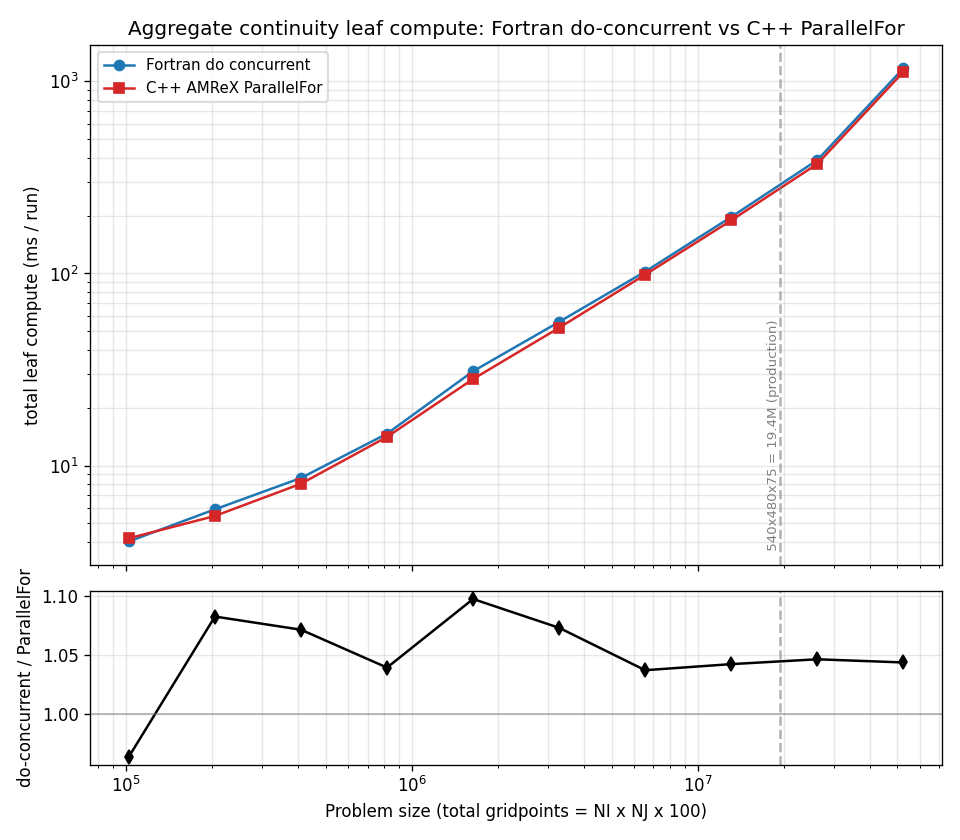
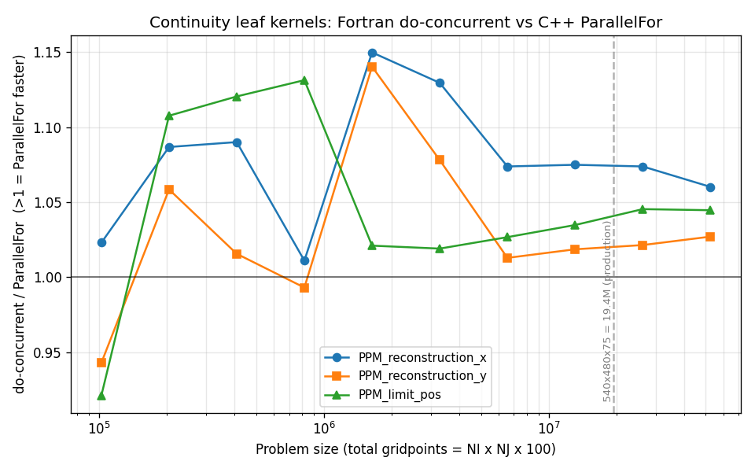
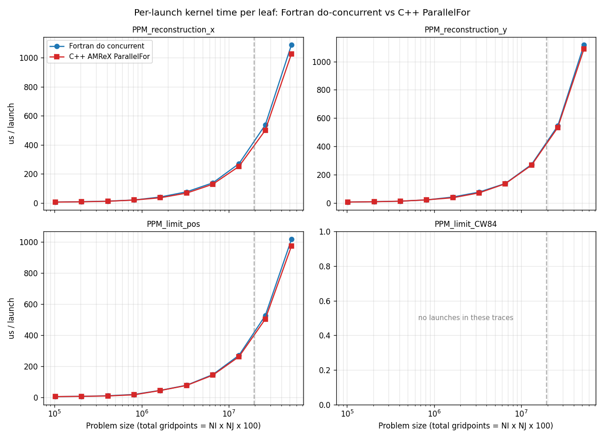

# MOM6 continuity leaf kernels: do-concurrent vs ParallelFor

**Generated:** 2026-06-16 19:20:43 on `derecho2`

## Intent

The same continuity PPM **leaf** kernels, two ways on one A100: Fortran `do concurrent` (`dev_turbo_GPU`) vs C++ AMReX `ParallelFor` (`iturbo_GPU_amrex`). These are the only continuity kernels that pair apples-to-apples -- standalone in both builds, matching launch counts, identical computation. Crucially, both sides are timed by the **same** profiler (nsys), unlike the compare-sweep which mixes FMS mpp_clock with AMReX TinyProfiler -- so this is the single-clock check on the programming model's effect on kernel compute. The transitional AMReX bridge is excluded.

| | config | implementation | stack |
|---|---|---|---|
| do-concurrent | `dev_turbo_GPU` | Fortran do concurrent | `/glade/work/altuntas/turbo-stack-dev-turbo` |
| ParallelFor | `iturbo_GPU_amrex` | C++ AMReX ParallelFor | `/glade/work/altuntas/turbo-stack-iturbo` |


<!-- commentary: key-finding -->

## Methodology

- **Source:** per-trace `*_cuda_gpu_kern_sum.csv` from `run-nsys-compare-sweep.sh`; a substring match on the auto-demangled `MOM::<routine>` name isolates each leaf. No nsys at report time.
- **Leaves:** `PPM_reconstruction_x/y`, `ppm_limit_pos`, `ppm_limit_cw84`; multiple GPU loops per routine are summed, and a size is flagged if the two sides' launch counts differ (not a clean pair).
- **Excluded:** the inlined `edge_thickness` wrappers, the un-ported solver bulk, and the transitional AMReX bridge (repack + copies).
- **Fair by construction:** same nvhpc 25.9 / `sm_80`, FMA off on both sides (`-Mnofma -Kieee` / `--fmad=false`), device code at `-O2` both ways -- so differences are intrinsic to the programming models, not the toolchain. Times are traced (Nsight) GPU kernel time.

<!-- commentary: methodology -->

## Aggregate leaf compute



Sum of all leaf kernels' GPU time per run vs problem size; lower panel is the do-concurrent / ParallelFor ratio (>1 = ParallelFor faster). The headline compute number.

<!-- commentary: total-compute -->

## Per-leaf ratio



Per-leaf do-concurrent / ParallelFor GPU-time ratio vs size (black line = parity; above it ParallelFor is faster).

<!-- commentary: ratio-trend -->

## Per-launch kernel time



GPU time for a single launch of each leaf (total / launches), decoupling per-kernel cost from launch count.

<!-- commentary: per-launch -->

## Per-leaf comparison

### PPM_reconstruction_x

| size | do-concurrent (ms) | launches | ParallelFor (ms) | launches | do-concurrent / ParallelFor |
|---|--:|--:|--:|--:|--:|
| 32x32x100 | 1.46 | 242 | 1.42 | 242 | 1.023x |
| 64x32x100 | 2.09 | 242 | 1.92 | 242 | 1.087x |
| 64x64x100 | 3.07 | 242 | 2.81 | 242 | 1.090x |
| 128x64x100 | 4.90 | 242 | 4.85 | 242 | 1.011x |
| 128x128x100 | 9.94 | 242 | 8.65 | 242 | 1.150x |
| 256x128x100 | 18.52 | 242 | 16.40 | 242 | 1.129x |
| 256x256x100 | 33.48 | 242 | 31.18 | 242 | 1.074x |
| 512x256x100 | 65.46 | 242 | 60.90 | 242 | 1.075x |
| 512x512x100 | 129.88 | 242 | 120.96 | 242 | 1.074x |
| 1024x512x100 | 394.11 | 362 | 371.74 | 362 | 1.060x |

### PPM_reconstruction_y

| size | do-concurrent (ms) | launches | ParallelFor (ms) | launches | do-concurrent / ParallelFor |
|---|--:|--:|--:|--:|--:|
| 32x32x100 | 1.35 | 242 | 1.43 | 242 | 0.943x |
| 64x32x100 | 2.07 | 242 | 1.95 | 242 | 1.058x |
| 64x64x100 | 2.98 | 242 | 2.94 | 242 | 1.016x |
| 128x64x100 | 5.14 | 242 | 5.18 | 242 | 0.993x |
| 128x128x100 | 10.05 | 242 | 8.81 | 242 | 1.140x |
| 256x128x100 | 18.47 | 242 | 17.13 | 242 | 1.078x |
| 256x256x100 | 33.21 | 242 | 32.79 | 242 | 1.013x |
| 512x256x100 | 65.71 | 242 | 64.51 | 242 | 1.019x |
| 512x512x100 | 131.72 | 242 | 128.96 | 242 | 1.021x |
| 1024x512x100 | 404.92 | 362 | 394.28 | 362 | 1.027x |

### PPM_limit_pos

| size | do-concurrent (ms) | launches | ParallelFor (ms) | launches | do-concurrent / ParallelFor |
|---|--:|--:|--:|--:|--:|
| 32x32x100 | 1.23 | 242 | 1.33 | 242 | 0.921x |
| 64x32x100 | 1.77 | 242 | 1.60 | 242 | 1.108x |
| 64x64x100 | 2.57 | 242 | 2.30 | 242 | 1.120x |
| 128x64x100 | 4.62 | 242 | 4.08 | 242 | 1.131x |
| 128x128x100 | 10.99 | 242 | 10.76 | 242 | 1.021x |
| 256x128x100 | 18.99 | 242 | 18.63 | 242 | 1.019x |
| 256x256x100 | 35.55 | 242 | 34.62 | 242 | 1.027x |
| 512x256x100 | 65.65 | 242 | 63.45 | 242 | 1.035x |
| 512x512x100 | 127.29 | 242 | 121.77 | 242 | 1.045x |
| 1024x512x100 | 368.15 | 362 | 352.44 | 362 | 1.045x |

<!-- commentary: leaf-comparison -->

## Provenance


### Stack: dev-turbo

- **turbo-stack:** `2524b9d-dirty` (dirty working tree) (`/glade/work/altuntas/turbo-stack-dev-turbo`)
- **MOM6 submodule:** `ulm-10623-g108388fb6` (`108388fb608d8b861232bc203fac21ab7bc8f28b`)
- **GPU build flags** (ncar-nvhpc.mk):
  ```make
  FPPFLAGS := $(shell pkg-config --cflags yaml-0.1) -DHAVE_FC_DO_CONCURRENT_LOCAL
  FFLAGS += -mp=gpu -gpu=cc80,mem:separate -stdpar=gpu -Minfo=accel
  CFLAGS += -mp=gpu -gpu=cc80,mem:separate
  ```
- **Submodule snapshot:**
  ```
  f6466d899b66198593d6d40b3e8ca3dcbd343d8b dev-utils/gcovlens (heads/main)
   2c04fb23d0ee9ceef6d61f1021652ccab62e8324 submodules/MARBL (marbl0.48.2)
  +108388fb608d8b861232bc203fac21ab7bc8f28b submodules/MOM6 (ulm-10623-g108388fb6)
   6dd6d69bdb7c9efd4e210e1c459a897d1b02d21f submodules/amrex (25.11)
   7e526687b96ca685100f73edf7ef49214d5d5a19 submodules/infra/FMS2 (heads/dev/turbo)
   1647f85f695cd8f288b6471a99a078f48226efc0 submodules/infra/TIM (1647f85)
   12ac400e141854b54e5ce08c27c3301ef7d80074 submodules/pFUnit (v4.16.0-31-g12ac400)
  ```

> **Warning:** the turbo-stack working tree had uncommitted changes when this report was generated, so the commit hash does not fully capture the build. The GPU build flags above are recorded explicitly for this reason.

### Stack: iturbo

- **turbo-stack:** `1ee62d2-dirty` (dirty working tree) (`/glade/work/altuntas/turbo-stack-iturbo`)
- **MOM6 submodule:** `ulm-10627-g1a8b32aa8` (`1a8b32aa89c04a2903502f6268effcfb746279d9`)
- **GPU build flags** (ncar-nvhpc.mk):
  ```make
  FPPFLAGS := $(shell pkg-config --cflags yaml-0.1) -DHAVE_FC_DO_CONCURRENT_LOCAL
  FFLAGS += -mp=gpu -gpu=cc80,mem:separate -stdpar=gpu -Minfo=accel
  CFLAGS += -mp=gpu -gpu=cc80,mem:separate
  ```
- **Submodule snapshot:**
  ```
  f6466d899b66198593d6d40b3e8ca3dcbd343d8b dev-utils/gcovlens (heads/main)
   2c04fb23d0ee9ceef6d61f1021652ccab62e8324 submodules/MARBL (marbl0.48.2)
  +1a8b32aa89c04a2903502f6268effcfb746279d9 submodules/MOM6 (ulm-10627-g1a8b32aa8)
   6dd6d69bdb7c9efd4e210e1c459a897d1b02d21f submodules/amrex (25.11)
   7e526687b96ca685100f73edf7ef49214d5d5a19 submodules/infra/FMS2 (heads/dev/turbo)
  +b3a1315ae319d437e2745dd099d6bb40ede085fd submodules/infra/TIM (heads/docs/io-diag-pio-roadmap)
   12ac400e141854b54e5ce08c27c3301ef7d80074 submodules/pFUnit (v4.16.0-31-g12ac400)
  ```

> **Warning:** the turbo-stack working tree had uncommitted changes when this report was generated, so the commit hash does not fully capture the build. The GPU build flags above are recorded explicitly for this reason.


